<div align="center">


<br><br>


<br>


<br><br>


<br><br>

<a href="#overview"><b>Overview</b></a> &nbsp;·&nbsp;
<a href="#feature-deep-dives"><b>Features</b></a> &nbsp;·&nbsp;
<a href="#high-level-design-hld"><b>HLD</b></a> &nbsp;·&nbsp;
<a href="#low-level-design-lld"><b>LLD</b></a> &nbsp;·&nbsp;
<a href="#data-model"><b>Data</b></a> &nbsp;·&nbsp;
<a href="#api-reference"><b>API</b></a> &nbsp;·&nbsp;
<a href="#security-design"><b>Security</b></a> &nbsp;·&nbsp;
<a href="#testing-strategy"><b>Testing</b></a> &nbsp;·&nbsp;
<a href="#quick-start"><b>Quick start</b></a> &nbsp;·&nbsp;
<a href="#roadmap"><b>Roadmap</b></a>

</div>

<br>

> **How to read this document.** It describes the full target design of the platform: what each part is, why it exists, how it fits together and how it is verified. The [Roadmap](#roadmap) shows what stage each part has reached. Nothing here claims a result that has not been measured.

---

## Contents

<table>
<tr>
<td valign="top" width="33%">

**Understand**
- [Overview](#overview)
- [The problem](#the-problem)
- [Design principles](#design-principles)
- [The tool-call pipeline](#the-tool-call-pipeline)

</td>
<td valign="top" width="33%">

**Explore**
- [Feature deep dives](#feature-deep-dives)
- [High-Level Design (HLD)](#high-level-design-hld)
- [Low-Level Design (LLD)](#low-level-design-lld)
- [Data model](#data-model)
- [API reference](#api-reference)

</td>
<td valign="top" width="33%">

**Verify and run**
- [Security design](#security-design)
- [Testing strategy](#testing-strategy)
- [Delivery pipeline](#delivery-pipeline)
- [Observability](#observability)
- [Quick start](#quick-start)
- [Demo script](#demo-script)
- [Roadmap](#roadmap)

</td>
</tr>
</table>

---

## Overview

Model Context Protocol (MCP) standardises how an AI application reaches tools and data. Agent2Agent (A2A) standardises how independent agents find each other and hand work over. Together they make agent systems far more capable, and far more dangerous when the point of execution is left unguarded.

**mcp-a2a-secure** puts the guard rails exactly there. It is a working MCP server and client, a Docker sandbox, a tool-schema integrity layer, a standalone security scanner and a real agent-to-agent delegation path, all observable through a live console and backed by a persistent audit trail.

<table>
<tr>
<td width="50%" valign="top">

**What it does**

- Exposes a real tool and resources over MCP, using the official Python SDK
- Authenticates every client and checks its scope before anything runs
- Fingerprints tool schemas and catches silent redefinitions
- Runs each permitted call in a fresh, locked-down container
- Scans MCP servers for selected weaknesses and reports evidence
- Delegates tasks between two independent agents over A2A
- Streams all of it to four live views and writes it to an audit log

</td>
<td width="50%" valign="top">

**What it deliberately is not**

- Not a universal vulnerability detector
- Not a guarantee that hostile code is harmless
- Not enterprise IAM or a login platform
- Not dependent on a paid LLM, a GPU, or a cloud service
- Not a system where a model's opinion can unlock a dangerous action

</td>
</tr>
</table>

**Who it is for:** AI infrastructure developers who want agents on tools without over-broad trust, security engineers who need to inspect MCP servers, and agent developers who need to trace which agent, tool and permission caused an action.

### At a glance

<table>
<tr>
<td width="33%" valign="top">

#### 🔐 Trusted execution
Auth, scopes, schema checks and a mandatory Docker sandbox stand between a request and a tool. No host fallback.

</td>
<td width="33%" valign="top">

#### 🧬 Rug-pull detection
Tool schemas are canonicalised and SHA-256 fingerprinted. Silent redefinitions are caught; versioned releases are not punished.

</td>
<td width="33%" valign="top">

#### 🛰️ Standalone scanner
A CLI that inspects this server or any other MCP server and reports category, severity, evidence and confidence.

</td>
</tr>
<tr>
<td valign="top">

#### 🤝 Real A2A delegation
A manager agent discovers a worker, verifies its Agent Card and delegates a task across two independent processes.

</td>
<td valign="top">

#### 📡 Live console
Four React views (Server, Sandbox, Scanner, A2A) fed by real backend events over SSE.

</td>
<td valign="top">

#### 🧾 Audit trail
Every decision is a persisted row with stable IDs, so an action can be reconstructed after the fact.

</td>
</tr>
</table>

### Built with

<p align="center">
  
</p>

<p align="center">
  <sub>
    Official Python MCP SDK · Pydantic v2 · SQLAlchemy · Alembic · Typer · Rich · Tree-sitter · Hypothesis · Ollama · cryptography (Ed25519) · React Flow · Recharts · TanStack Query · Zustand
  </sub>
</p>

---

## The problem

A protocol-compliant connection tells you two parties can talk. It does not tell you the tool is safe, the server is honest, or the permissions are sensible. A malicious or compromised MCP server can:

- expose a tool that runs attacker-controlled commands,
- **change a tool's definition after you already trusted it** (a *rug pull*),
- request broader access than it needs,
- return content crafted to steer the agent that reads it.

The project treats tool calls, tool definitions, server content and delegated tasks as **untrusted until the relevant controls have been applied**.

<details>
<summary><b>Ecosystem signals that motivated the design</b></summary>

<br>

These figures come from the sources cited in the project's research notes. They are used as motivation, not as universal measurements of the whole ecosystem.

| Signal | Reported figure | What it motivates |
|--------|-----------------|-------------------|
| Command injection | 43% of tested MCP servers | Sandboxing, argument validation |
| Path traversal | 82% of surveyed implementations | Restricted filesystem access |
| Critical vulnerability | 33% of 1,000 scanned servers | A reusable scanner |
| Code injection / missing auth | 67% and 34 to 38% in cited analyses | Validation, per-client scopes |
| CVE volume | 30+ in a 60-day window in early 2026 | An active, moving attack surface |
| Tool poisoning | Named as a primary attack class | Schema and output trust controls |

**Where this fits.** Registries focus on discovery, gateways focus on routing, and inspectors help developers look at protocol traffic. This project takes a different lane: **trustworthy execution, shareable security scanning, and real A2A delegation.**

</details>

---

## Design principles

| # | Principle | In practice |
|:-:|-----------|-------------|
| 1 | **Deny by default** | If auth, authorization, schema integrity or sandbox policy cannot be established, the call is refused. It never falls back to host execution. |
| 2 | **The model is not the boundary** | An LLM can enrich evidence or raise a warning. It cannot grant permission, change a baseline or disable the sandbox. |
| 3 | **Sandboxing is mandatory** | There is no code path that executes a tool outside a container. |
| 4 | **Least privilege everywhere** | Clients, tools, resources and container mounts all get the minimum they need. |
| 5 | **Trust definitions only after integrity checks** | A tool schema is trusted because its fingerprint matches, not because it says so. |
| 6 | **Versioned change is not an attack** | A signed release and a silent mutation are handled differently. |
| 7 | **Every claim has a test** | If it cannot be reproduced, it does not go in the demo. |
| 8 | **Free-first** | Core security controls run with no paid model and no GPU. |
| 9 | **The UI shows real behaviour** | Every view is driven by backend events, never placeholders. |
| 10 | **Findings are disclosed responsibly** | Third-party weaknesses go through coordinated disclosure. |

---

## The tool-call pipeline

A tool call is not a function call. It is a request that has to clear a sequence of gates, and any gate can close the door.

<p align="center">
  
  
  
  
  
  <br>
  
  
  
  
  
</p>

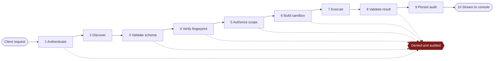

| # | Gate | Question it answers | Failure state |
|:-:|------|---------------------|---------------|
| 1 | **Authenticate** | Is this a known client with a valid API key? | `AUTH_REJECTED` |
| 2 | **Discover** | What does this server advertise right now? | negotiation error |
| 3 | **Validate** | Do the arguments match the registered schema? | `SCHEMA_INVALID` |
| 4 | **Fingerprint** | Is this the tool definition we trusted before? | `TAMPER_DETECTED` |
| 5 | **Authorize** | Does *this client* hold the scope for *this tool*? | `PERMISSION_DENIED` |
| 6 | **Sandbox** | Can the full isolation policy be established? | `SANDBOX_DENIED` |
| 7 | **Execute** | Did the tool finish inside the container? | `EXECUTION_FAILED` |
| 8 | **Validate result** | Is the output well-formed and safe to return? | `RESULT_INVALID` |
| 9 | **Audit** | Is the decision recorded with stable IDs? | call does not complete |
| 10 | **Stream** | Can the console show what happened? | non-blocking |

Happy path: `REQUESTED → AUTHENTICATED → SCHEMA_VERIFIED → AUTHORIZED → SANDBOX_READY → EXECUTING → RESULT_CAPTURED → AUDITED → COMPLETED`

---

## Feature deep dives

Every feature is described the same way: **what it is for, how it works, what it protects against, and how it is proven.**

| # | Feature | Priority |
|:-:|---------|:--------:|
| 1 | [MCP server](#feature-1-mcp-server) | Must |
| 2 | [MCP client](#feature-2-mcp-client) | Must |
| 3 | [Transports](#feature-3-transports) | Must |
| 4 | [Resources and subscriptions](#feature-4-resources-and-subscriptions) | Should |
| 5 | [Multi-server aggregation](#feature-5-multi-server-aggregation) | Should |
| 6 | [Authentication, sessions and rate limiting](#feature-6-authentication-sessions-and-rate-limiting) | Must |
| 7 | [Authorization and scopes](#feature-7-authorization-and-scopes) | Must |
| 8 | [Sandboxed execution](#feature-8-sandboxed-execution) | Must |
| 9 | [Schema tamper detection](#feature-9-schema-tamper-detection) | Must |
| 10 | [Security scanner](#feature-10-security-scanner) | Must |
| 11 | [A2A delegation](#feature-11-a2a-delegation) | Must |
| 12 | [LLM layer](#feature-12-llm-layer) | Should |
| 13 | [Live console](#feature-13-live-console) | Must |
| 14 | [Persistence and audit](#feature-14-persistence-and-audit) | Must |

---

### Feature 1: MCP server

| | |
|---|---|
| **Purpose** | Expose a real tool and real resources through the standard protocol so any MCP client can discover and use them. |
| **Built on** | Official Python MCP SDK, FastAPI, Pydantic v2 |
| **Proof** | An independent MCP client initialises, discovers the tool and gets a schema-valid result (TEST-001, TEST-004) |

The server does not re-implement the protocol. It uses the official SDK for JSON-RPC messaging, lifecycle and capability negotiation, and spends its own effort on what the SDK does not decide for you: who is calling, whether the definition can be trusted, and where the code actually runs.

**Responsibilities**

- Advertise tools and resources with explicit, typed schemas
- Validate every input with Pydantic v2 before it goes anywhere near execution
- Enforce client authentication and scopes
- Route permitted calls into the sandbox, never into the host process
- Emit structured events for every decision

**Lifecycle**

| Phase | What happens | Project responsibility |
|-------|--------------|------------------------|
| Initialize | Version and capability negotiation | Reject incompatibility, record client and server identities |
| Operate | Requests, responses, notifications | Validate, authorize, sandbox, stream |
| Shutdown | Connection ends | Release resources, persist relevant audit state |

The target tool is a **local filesystem / notes tool**, chosen because its dangerous behaviour (path handling, file access) is easy to demonstrate safely and maps directly onto path traversal and over-sharing risks.

---

### Feature 2: MCP client

| | |
|---|---|
| **Purpose** | Discover capabilities dynamically and call them, with no hard-coded tool definitions. |
| **Built on** | Official Python MCP client |
| **Proof** | Version and capability negotiation completes; discovered tools and resources are recorded (TEST-001) |

The client initialises the session, negotiates the protocol version and optional capabilities, lists tools and resources, and records what it found. It routes calls to the right server, and handles protocol errors, cancellation and timeouts explicitly instead of letting them surface as hangs. If the server and client cannot agree on a version, the incompatibility is surfaced and audited rather than papered over.

The same client powers the scanner's live probing and the A2A worker's tool use, so there is one implementation of "talk MCP correctly" in the codebase.

---

### Feature 3: Transports

| | |
|---|---|
| **Purpose** | Move protocol messages between client and server on the paths real clients use. |
| **Supports** | `stdio` and Streamable HTTP; SSE for streaming and for live console events |
| **Proof** | Transport tests exercise both paths (Protocol and Transport test categories) |

| Transport | How it works | Security point |
|-----------|--------------|----------------|
| **stdio** | The client launches the server as a subprocess and exchanges JSON-RPC over stdin and stdout | `stdout` must carry only valid protocol messages, so all logging goes to `stderr` |
| **Streamable HTTP** | The server exposes one HTTP endpoint using POST and GET; SSE can stream server messages | Validate `Origin`, bind to localhost for local use, require authentication |
| **SSE (console feed)** | One-way stream of backend events to the browser through `EventSource` | Same auth as the API; carries no secrets |

**Terminology note.** Older material calls the HTTP path "HTTP+SSE". The current MCP documentation describes **Streamable HTTP** as its replacement, and this project uses that term. The legacy wording is mentioned only where compatibility is genuinely implemented.

---

### Feature 4: Resources and subscriptions

| | |
|---|---|
| **Purpose** | Offer URI-addressable context (files, schemas, data) and let clients watch it change. |
| **Priority** | Should |
| **Proof** | A subscribed client receives an update notification when a resource changes, and the update appears in the audit trail |

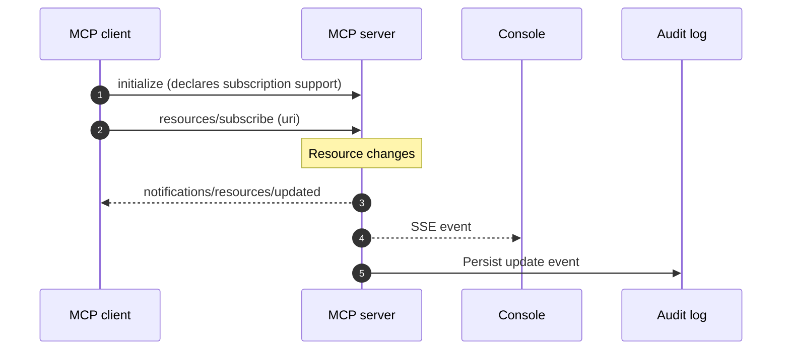

Resources are scoped like tools: a client can only subscribe to URIs it holds a scope for, which is how the design avoids over-sharing context.

---

### Feature 5: Multi-server aggregation

| | |
|---|---|
| **Purpose** | Give an orchestrator one place to use many MCP servers without blurring who owns what. |
| **Priority** | Should |
| **Proof** | One orchestrator calls tools on two upstream servers; each call is routed and permission-checked against the right one |

Aggregation is dangerous when it merges trust. The design therefore keeps each upstream separate:

- a **per-server capability map**, so the orchestrator knows exactly what each server offers
- **collision-safe naming**, so two servers exposing `read_file` never shadow each other
- **correct routing**, so a call always reaches the upstream it was resolved against
- **preserved boundaries**, so a client's permissions on server A say nothing about server B
- **per-server fingerprints**, so a rug pull on one upstream cannot hide behind another

---

### Feature 6: Authentication, sessions and rate limiting

| | |
|---|---|
| **Purpose** | Establish who is calling before anything else happens. |
| **Mechanism** | Static per-client API keys through FastAPI `APIKeyHeader`; a session manager; per-client rate limits |
| **Proof** | Missing and invalid keys are rejected before execution (TEST-002) |

The project deliberately does **not** build a login platform. OAuth2, password hashing, sessions and accounts would consume weeks and would not demonstrate anything about MCP or A2A security. A per-client key lookup shows least-privilege authorization cleanly, at a fraction of the cost.

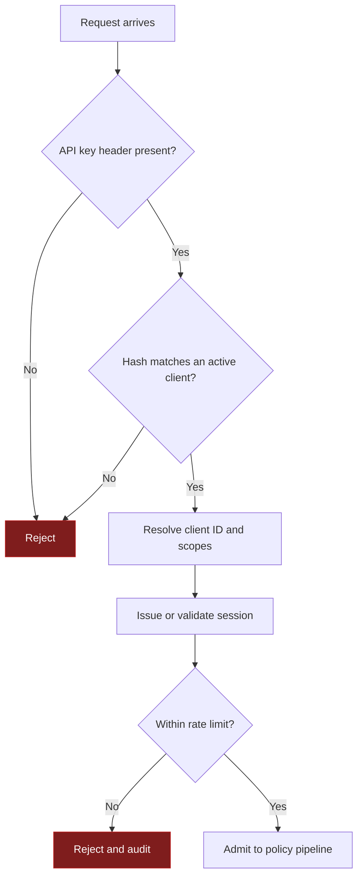

Only **hashes** of API keys are stored. Raw keys are generated locally, shown once and never committed. The original stack also dropped `python-jose` and `passlib[bcrypt]` for this scope because of maintenance concerns; if user-level JWTs are ever added, they belong in a separate, actively maintained module.

---

### Feature 7: Authorization and scopes

| | |
|---|---|
| **Purpose** | Make sure an authenticated client can only do what it was granted. |
| **Mechanism** | Explicit scopes per client, checked per tool and per resource |
| **Proof** | Insufficient scope is denied and audited before the sandbox is reached (TEST-003) |

Authentication answers *who*; authorization answers *what they may do*. A client key carries a set of scopes, and the policy layer checks the requested tool or resource against them. Wildcards are never the default, and a missing scope produces `PERMISSION_DENIED` plus an audit event. Because this check runs before the sandbox is built, a denied call costs no container.

A clear boundary to keep in mind: **API-key scopes are not enterprise IAM.** They demonstrate least privilege and nothing more, and the project does not claim otherwise.

---

### Feature 8: Sandboxed execution

| | |
|---|---|
| **Purpose** | Ensure a tool's behaviour is separated from the host, regardless of what its schema or the model says. |
| **Built on** | Docker Engine API through `docker-py` |
| **Proof** | Adversarial suite for filesystem, privilege, network and exhaustion abuse, run against a real Docker daemon in CI (TEST-004, TEST-005) |

The sandbox is the primary runtime boundary. A permitted call goes through this lifecycle:

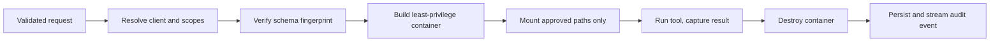

| Control | Setting | Why it exists |
|---------|---------|---------------|
| Lifetime | Fresh container per call, removed after success or failure | No state carries between calls |
| Root filesystem | Read-only | Nothing persists inside the container |
| Mounts | Scoped bind mounts to approved paths, read-only where possible | No arbitrary host access |
| Network | `none`, deny by default | Blocks exfiltration and callbacks |
| Capabilities | `cap_drop=["ALL"]` | Removes privileged operations |
| User | Non-root where supported | Limits blast radius |
| Resources | CPU, memory and process limits | Contains exhaustion and fork bombs |
| Failure mode | **Fail closed** | If any control cannot be applied, the call is refused |

<details>
<summary><b>Illustrative container configuration</b></summary>

<br>

```python
container = docker_client.containers.run(
    image=tool.image,
    command=argv,
    detach=True,
    network_mode="none",              # no egress
    read_only=True,                   # immutable root filesystem
    cap_drop=["ALL"],                 # no Linux capabilities
    user="65534:65534",               # non-root
    security_opt=["no-new-privileges"],
    mem_limit="256m",
    nano_cpus=500_000_000,            # 0.5 CPU
    pids_limit=64,
    tmpfs={"/tmp": "size=16m,noexec,nosuid"},
    volumes={approved_path: {"bind": "/workspace", "mode": "ro"}},
    labels={"tool_call_id": tool_call_id, "client_id": client_id},
)
```

</details>

The sandbox targets the Docker Engine API so it stays portable. OrbStack is used on the author's Mac as a convenience and is never a dependency. The sandbox **reduces** risk; it is not a promise that arbitrary hostile code is harmless.

---

### Feature 9: Schema tamper detection

| | |
|---|---|
| **Purpose** | Catch a server silently redefining a tool after you trusted it. |
| **Mechanism** | Canonicalise, SHA-256 fingerprint, trust on first use, version-aware policy |
| **Proof** | Silent change is flagged; version-bumped change is treated differently (TEST-006, TEST-007) |

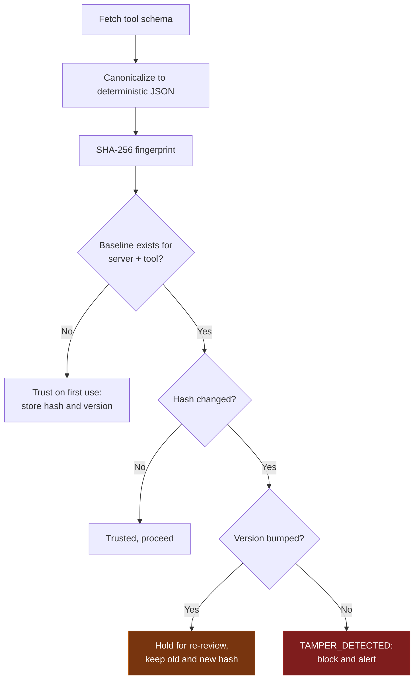

| Stage | Action | Stored or checked |
|-------|--------|-------------------|
| First connect | Canonicalise the schema | Deterministic byte representation |
| Fingerprint | SHA-256 | Schema hash |
| Baseline | Persist identity | `server_id` + `tool_name` + hash + version |
| Later call | Canonicalise again | Current hash |
| Compare | Hash plus version policy | Approved update or suspicious change |
| Decision | Allow, hold for re-review, or refuse | Audit event |

**Why canonicalisation matters.** Two byte-different serialisations of the same schema must produce the same fingerprint, otherwise reordered keys or whitespace would raise false alarms. The canonical form sorts keys, fixes separators and encoding, and drops fields that legitimately vary per session. Both the old and new fingerprints are stored on any change, so a reviewer can see exactly what moved.

**The policy in one line:** a silent change under an unchanged version is suspicious; a version-bumped change is a release and goes to review, not to alarm.

---

### Feature 10: Security scanner

| | |
|---|---|
| **Purpose** | Inspect this server or any MCP server and report weaknesses with evidence. |
| **Shape** | Standalone CLI, independently installable, also callable through the backend |
| **Proof** | Seeded fixture suite with zero false negatives *on that suite* (TEST-008) |

The scanner is intentionally separate from the platform so it can stand as its own portfolio artifact. It runs offline from the live request path.

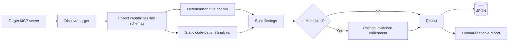

**What it checks in the current build**

| Category | Method | Example signal |
|----------|--------|----------------|
| Command injection | Tree-sitter (Python, JavaScript) plus heuristics | User-controlled argument reaching a shell or `subprocess` with `shell=True` |
| Path traversal | Static rules on file-handling paths | Path built from input without normalisation or containment |
| Tool poisoning | Description and schema inspection, optional LLM review | Hidden directives or instructions embedded in tool text |
| Missing authentication | Live probe through the MCP client | Tool listing or calls succeed without credentials |
| Tampered schemas | Fingerprint comparison against a baseline | Hash differs under an unchanged version |

The full OWASP MCP Top 10 remains the conceptual framework. Practical coverage is trimmed to the five categories above so each one can be seeded, detected and proven.

**Finding format**

```json
{
  "scan_run_id": "scan_0007",
  "target_server": "fixture-command-injection",
  "tool_or_resource": "run_report",
  "category": "command_injection",
  "severity": "critical",
  "confidence": 0.92,
  "evidence": "User-controlled `template` argument reaches subprocess with shell=True"
}
```

Every finding carries at least **category, severity, evidence and confidence**, plus the target and scan run it belongs to.

**The fixture rule.** Each fixture is a small controlled target with one seeded flaw, an expected category, expected evidence, expected severity and expected scanner behaviour. The success metric is *zero false negatives against that documented suite*. It is a bounded, reproducible claim, and it is never presented as coverage of the real world.

```bash
# Scan a local target over stdio
mcp-a2a-scan run --target "stdio:python fixtures/command_injection/server.py"

# Scan a remote target and write machine-readable output
mcp-a2a-scan run --target http://localhost:9000/mcp --format json --output report.json
```

---

### Feature 11: A2A delegation

| | |
|---|---|
| **Purpose** | Let one independent agent discover another, delegate work and get a result, without sharing memory or tool internals. |
| **Shape** | Manager (Agent A) and worker (Agent B) as separate processes over HTTP |
| **Proof** | One complete, verified manager to worker cycle (TEST-010) |

Where MCP is the *vertical* layer (an agent reaching its tools), A2A is the *horizontal* one (agents reaching each other). The worker publishes an **Agent Card** describing its identity, endpoint, capabilities and skills. The manager finds it, verifies it, and delegates.

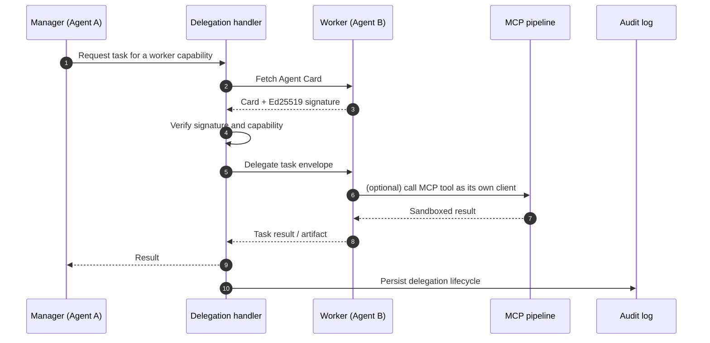

**Task lifecycle:** `AGENT_DISCOVERED → CARD_VERIFIED → TASK_SENT → TASK_ACCEPTED → TASK_EXECUTING → RESULT_RETURNED → AUDITED`

**Signing.** Agent Cards are signed with **Ed25519** using the `cryptography` library, producing a detached JSON signature. Private keys are generated at setup, kept in an ignored local file, and never committed or stored in the database. Only **public keys** are persisted.

**Honest interoperability note.** A2A 1.0 describes JWS for signing Agent Cards. The detached Ed25519 format here is a *project implementation mechanism*. If strict external interoperability is needed, the representation should be aligned with A2A 1.0 before anyone calls it the protocol standard.

**Fallback.** If verified signing is not ready, an unsigned local delegation between two independent processes still proves the task hand-off. It does not prove identity, and the console labels it explicitly as **unverified**.

---

### Feature 12: LLM layer

| | |
|---|---|
| **Purpose** | Add optional intelligence: poisoning analysis, A2A agent behaviour, an MCP test harness. |
| **Default** | Ollama (local, free) behind a pluggable `LLMBackend` |
| **Proof** | Evaluated separately from security controls; platform still passes its core tests with the LLM disabled |

The LLM is **not** the security foundation. Static checks, protocol tests, authorization and the sandbox all work without a model. When a model is used, it can enrich evidence or raise a warning, and that is all.

| Use case | Default | Optional | Rule |
|----------|---------|----------|------|
| Scanner: poisoning | Ollama `llama3.2:3b` or `qwen2.5:7b` | Groq free tier | Static checks work offline |
| A2A manager | Ollama `qwen2.5:7b` or `llama3.1:8b` | Groq free tier | Pluggable backend |
| A2A worker | Ollama `llama3.2:3b` | Groq free tier | Independent process |
| MCP test harness | Same local model | Groq free tier | Exercises the tool flow |

**Prompt contract.** The model may only use supplied evidence, must not recommend bypassing auth, integrity checks or the sandbox, must state uncertainty, and must separate observed fact from inference. Its output is validated against a schema before use:

```json
{
  "summary": "...",
  "riskCategories": [],
  "evidence": [],
  "confidence": 0.0,
  "uncertainties": [],
  "recommendedReview": "..."
}
```

**Guardrails.** Validate structured output. Never let a model response override a deterministic block. Never execute commands suggested by tool output. Keep provider credentials out of source control. Record which model produced any LLM-assisted evidence shown in a demo. A model outage degrades optional features only.

---

### Feature 13: Live console

| | |
|---|---|
| **Purpose** | Make the backend's behaviour visible, so claims can be seen rather than trusted. |
| **Built on** | React 18, Vite, TypeScript, Tailwind, shadcn/ui, Recharts, React Flow, TanStack Query, Zustand |
| **Proof** | Frontend tests confirm rendered state matches backend events (TEST, Frontend category) |

Every view answers one operational question with real data.

| View | Shows | Live source |
|------|-------|-------------|
| **Server Status** | Target and connection state, transport, negotiated capabilities, tools and resources, client identity and scopes, fingerprint and version state | Server and client events |
| **Sandbox** | Tool-call feed with request ID, policy decision, container ID and lifecycle, restrictions applied, result or block reason, cleanup status | Structured JSON over SSE |
| **Scanner** | Target, scan progress, findings by category, severity, evidence and confidence, fixture status, report and JSON export, and a clear note that fixture results are not universal coverage | CLI to FastAPI to SSE |
| **A2A** | Manager and worker identities, Agent Card and verification state, task status, a React Flow graph of manager, worker and task, and an explicit *unverified* marker in fallback mode | A2A events over SSE |

An **Audit and Event History** panel adds timestamp, event type, identifiers (client, tool, server, container, scan, agent), the decision and reason, schema version and fingerprint, with filter and search.

**Console preview**

<table>
<tr>
<td width="50%"></td>
<td width="50%"></td>
</tr>
<tr>
<td></td>
<td></td>
</tr>
</table>

<!-- To replace a placeholder: open any GitHub issue or PR, drag your screenshot into the comment box,
     copy the generated image URL, and paste it into the matching  above. -->

**States.** Each view defines loading, empty, connected, active, success, blocked and error states. A blocked action explains *why* in plain language.

**Accessibility.** Keyboard navigation, semantic labels, readable contrast, visible focus, responsive layout, and status that never depends on colour alone.

---

### Feature 14: Persistence and audit

| | |
|---|---|
| **Purpose** | Be able to answer, after the fact, what happened and why. |
| **Built on** | SQLite, SQLAlchemy, aiosqlite, Alembic |
| **Proof** | Records remain queryable after an application restart |

SQLite gives zero-infrastructure setup, and Alembic provides explicit migrations so a clean clone reaches the right schema before services start. The design follows data minimisation: store API-key hashes, never private signing keys, avoid unnecessary user data, and keep enough evidence to reproduce a security finding. Stable IDs and timestamps let frontend and backend events be correlated.

The goal a reviewer should be able to meet: *who requested the action, which scope permitted it, which schema version was trusted, which container ran it, what the scanner found, which agent delegated the task, and what came back.* See [Data model](#data-model) for the tables.

---

## High-Level Design (HLD)

The system is separated by **trust boundary and plane**, not merely by technology.

### System view

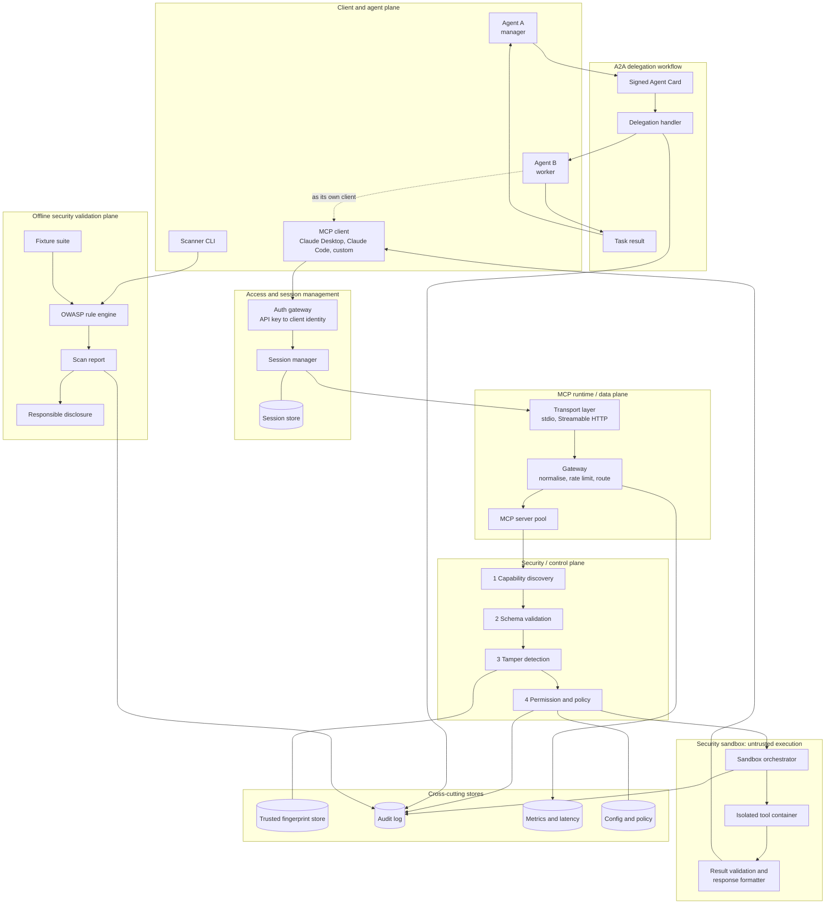

### Trust boundaries

Two things in this system are untrusted by default: what comes *in* (clients, tool descriptions, A2A messages) and where code *runs* (the container). Only the control plane in between is trusted.

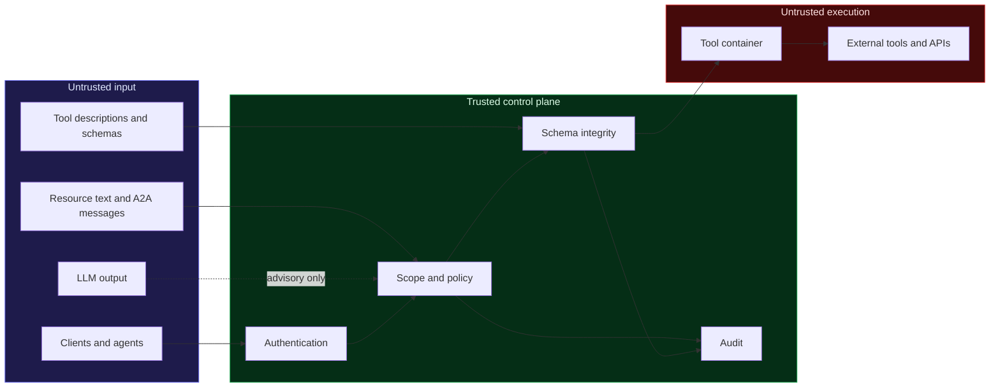

### Components

| Component | Responsibility |
|-----------|----------------|
| **MCP client, Agent A, Agent B** | Initiate MCP tool requests; Agent A delegates via A2A; Agent B executes and may call MCP tools itself |
| **Auth gateway and session manager** | Resolve identity from the API key, issue and renew sessions, persist them before any MCP traffic proceeds |
| **Transport layer and gateway** | Handle `stdio` and Streamable HTTP, normalise messages, apply per-client rate limits, route to the server pool |
| **MCP server pool** | Horizontally scalable set of server instances that expose tools and resources |
| **Security / control plane** | Capability discovery, schema validation, tamper detection against the fingerprint store, then policy check; denied calls get an audited MCP error |
| **Sandbox orchestrator and container** | Create a restricted container per call through the Docker Engine API, execute, clean up, validate the result |
| **Scanner CLI and rule engine** | Offline inspection of a target against seeded fixtures and deterministic OWASP-mapped checks |
| **Disclosure workflow** | Routes confirmed third-party findings through coordinated disclosure before publication |
| **A2A delegation handler** | Verifies the Agent Card and signature, routes the task envelope, tracks status, emits an audit event |
| **Audit, metrics and policy stores** | Persist tool calls, decisions, sandbox events, delegations, findings, latency and configuration |

### End-to-end data flow

1. A client, or Agent B acting as one, connects through the transport layer and supplies an API key.
2. The auth gateway resolves identity; the session manager issues or validates session state.
3. The gateway normalises the message, applies rate limiting and routes to a server in the pool.
4. **Capability discovery** resolves the requested tool against the advertised schema.
5. **Schema validation** checks the call against the registered schema.
6. **Tamper detection** compares the schema fingerprint to the trusted store. A silent change is flagged; a signed, version-bumped change is allowed to go to review.
7. **Policy check** enforces least-privilege scope. A denied call is rejected with an audited MCP error.
8. A permitted call reaches the sandbox orchestrator, which creates an isolated container with the configured restrictions.
9. The tool executes and the result is captured.
10. The container is destroyed after success or failure.
11. The result is validated and the MCP response is returned to the caller.
12. The event is persisted to the audit log and streamed to the console over SSE.
13. Independently, the scanner can inspect the same or another MCP target through the offline plane.
14. For A2A, Agent A creates a task backed by a signed card; the handler verifies it; Agent B executes (optionally re-entering steps 1 to 12) and returns the result, which is audited.

### Scalability and reliability

**Scalability.** The project starts as a small set of modular services. MCP handling, policy, sandbox execution, scanning and A2A are separated in code so each can be scaled independently later, without paying for premature microservices. Aggregation preserves each upstream's identity, capability map and permission boundary.

**Reliability.**

- Security checks always happen before execution
- A failed required control blocks the request; there is no host fallback
- Container cleanup runs after success and failure
- Protocol errors, cancellation and timeouts are handled explicitly
- Scan runs and delegations have visible lifecycle state
- Required audit data is persisted
- A2A verification failure blocks *verified* delegation

### Deployment view

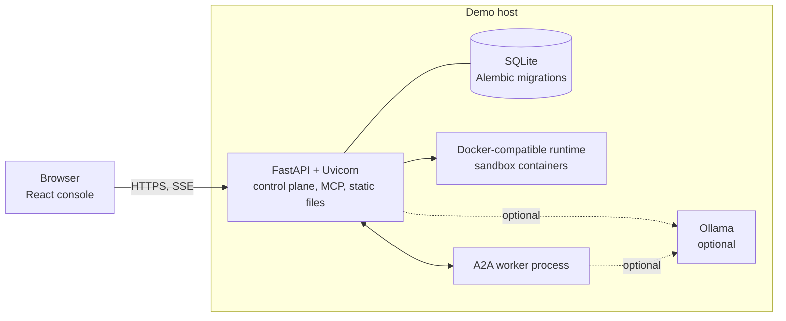

The frontend is built with Vite and served as static assets from FastAPI so a demo can run as one service. The A2A manager and worker run as independent processes. Ollama starts only when LLM features are being tested. **No GPU is required** for any core feature.

---

## Low-Level Design (LLD)

### Backend modules

```text
app/
├── api/          FastAPI routes, dependency wiring, SSE endpoint
├── auth/         API-key lookup, hashing, client resolution
├── session/      Session issue, renewal, store access
├── gateway/      Transport handling, message parsing, rate limiting, routing
├── mcp/          MCP server and client wrappers over the official SDK
├── policy/       Scope model, allow/deny decisions
├── integrity/    Canonicalisation, fingerprints, tamper policy
├── sandbox/      Container orchestration, restrictions, cleanup, result validation
├── scanner/      Scanner integration and report endpoints
├── a2a/          Agent Cards, signing, verification, delegation service
├── audit/        Audit event recording
├── database/     SQLAlchemy models, repositories, session handling
├── llm/          LLMBackend interface and provider adapters
├── events/       Structured event bus feeding SSE
└── common/       Errors, IDs, config, shared types
```

The service layout is the implementation boundary, not a set of microservices. The scanner stays independently installable even though FastAPI hosts its integration endpoints.

### Key interfaces

<details open>
<summary><b>ToolExecutionPipeline</b> — the spine of a tool call</summary>

<br>

```python
class ToolExecutionPipeline(Protocol):
    async def authenticate(self, client_key: str) -> Client: ...
    async def discover(self, server_id: str) -> Capabilities: ...
    async def validate_schema(self, tool: ToolRef, arguments: dict) -> None: ...
    async def verify_fingerprint(self, tool: ToolRef) -> IntegrityVerdict: ...
    async def authorize(self, client: Client, tool: ToolRef) -> PolicyDecision: ...
    async def execute_in_sandbox(self, tool: ToolRef, arguments: dict) -> RawResult: ...
    async def validate_result(self, result: RawResult) -> ToolResult: ...
    async def record_event(self, event: AuditEvent) -> None: ...
```

</details>

<details>
<summary><b>RequestGateway</b></summary>

<br>

```python
class RequestGateway(Protocol):
    async def accept_transport(self, request: TransportRequest) -> None: ...
    def parse_message(self, raw: bytes) -> McpMessage: ...
    async def rate_limit(self, client_id: str) -> None: ...
    async def route_to_server(self, message: McpMessage) -> ServerHandle: ...
```

</details>

<details>
<summary><b>SandboxOrchestrator</b></summary>

<br>

```python
class SandboxOrchestrator(Protocol):
    async def create_container(self, tool: ToolRef, policy: SandboxPolicy) -> Container: ...
    async def apply_restrictions(self, container: Container) -> None: ...
    async def execute(self, container: Container, arguments: dict) -> RawResult: ...
    async def cleanup(self, container: Container) -> None: ...     # always runs
    def validate_result(self, raw: RawResult) -> ToolResult: ...
    def format_response(self, result: ToolResult) -> McpResponse: ...
```

</details>

<details>
<summary><b>SecurityScanner</b></summary>

<br>

```python
class SecurityScanner(Protocol):
    async def discover_target(self, target: TargetSpec) -> Target: ...
    async def collect_capabilities(self, target: Target) -> Capabilities: ...
    def run_deterministic_checks(self, target: Target) -> list[RawFinding]: ...
    def analyze_code_patterns(self, source: SourceBundle) -> list[RawFinding]: ...
    def build_findings(self, results: list[RawFinding]) -> list[Finding]: ...
    def write_report(self, findings: list[Finding]) -> Report: ...
```

</details>

<details>
<summary><b>A2ADelegationService and LLMBackend</b></summary>

<br>

```python
class A2ADelegationService(Protocol):
    async def load_agent_card(self, worker: AgentRef) -> AgentCard: ...
    def verify_agent_card(self, card: AgentCard) -> VerificationResult: ...
    def create_task(self, scope: TaskScope) -> Task: ...
    async def delegate(self, worker: AgentRef, task: Task) -> DelegationHandle: ...
    async def track_status(self, task_id: str) -> TaskStatus: ...
    async def record_result(self, result: TaskResult) -> None: ...


class LLMBackend(Protocol):
    name: str
    async def complete(self, system: str, prompt: str, *, schema: type[BaseModel]) -> BaseModel: ...
```

</details>

### Tool-call sequence

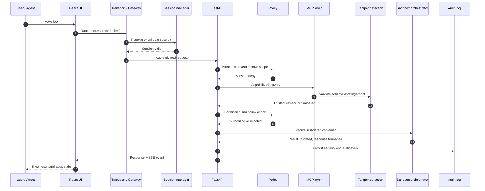

### State machines

**MCP tool call**

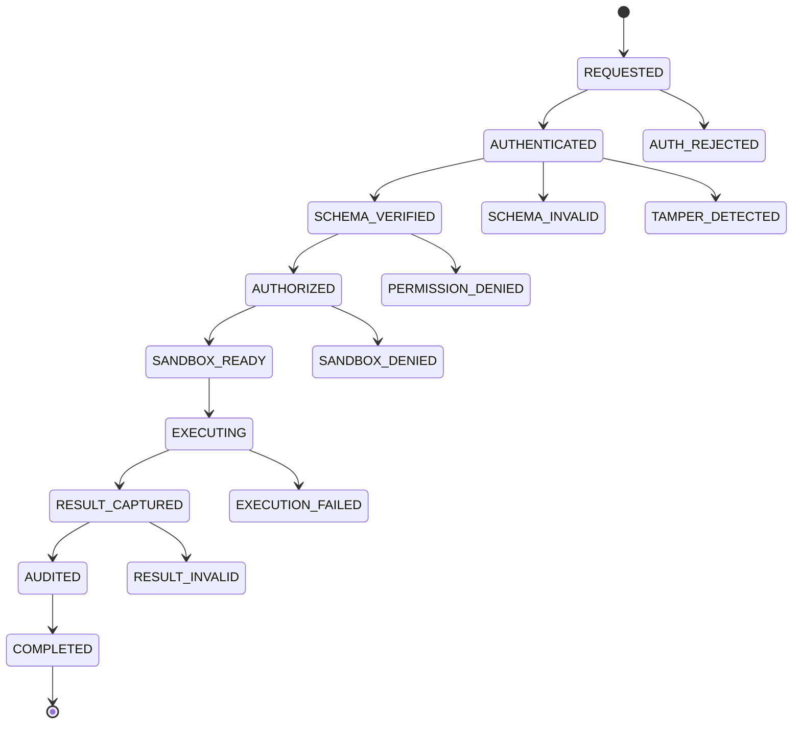

**Scanner run**

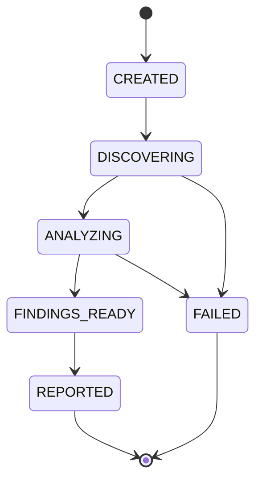

**A2A delegation**

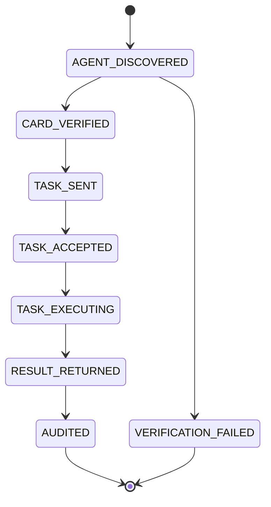

### Fingerprinting algorithm

```python
import hashlib, json

VOLATILE_FIELDS = {"_meta", "annotations.lastModified"}   # never part of identity

def canonicalize(schema: dict) -> bytes:
    cleaned = strip_fields(schema, VOLATILE_FIELDS)
    return json.dumps(
        cleaned, sort_keys=True, separators=(",", ":"), ensure_ascii=False
    ).encode("utf-8")

def fingerprint(schema: dict) -> str:
    return hashlib.sha256(canonicalize(schema)).hexdigest()

def verdict(baseline: Baseline | None, current_hash: str, current_version: str) -> Verdict:
    if baseline is None:
        return Verdict.TRUST_ON_FIRST_USE
    if baseline.hash == current_hash:
        return Verdict.TRUSTED
    if current_version != baseline.version:
        return Verdict.REVIEW_REQUIRED     # legitimate release, keep old and new hash
    return Verdict.TAMPER_DETECTED         # silent change: block and alert
```

### Sandbox lifecycle

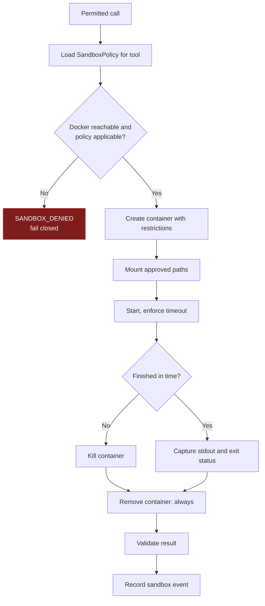

Cleanup sits in a `finally` path so it runs on success, failure, timeout and cancellation. A cleanup failure is itself an alertable event.

### Errors

Errors use stable internal codes and carry the request, scan, tool-call or delegation ID. A security failure explains *why* the action was blocked without exposing secrets, raw stack traces or host details.

| Code | Meaning |
|------|---------|
| `AUTH_REJECTED` | Missing or invalid API key |
| `PERMISSION_DENIED` | Authenticated, but the scope is missing |
| `SCHEMA_INVALID` | Arguments do not match the registered schema |
| `TAMPER_DETECTED` | Tool definition changed silently |
| `SANDBOX_DENIED` | Isolation policy could not be established |
| `EXECUTION_FAILED` | Tool failed or timed out in the container |
| `RESULT_INVALID` | Output failed validation |
| `VERIFICATION_FAILED` | Agent Card or signature could not be verified |

Transient LLM failures degrade optional features only. They must never disable authorization, tamper detection, the scanner's deterministic rules or the sandbox.

### Input validation

Validated before the corresponding operation proceeds: API inputs, MCP schemas, tool arguments, client scopes, target identifiers, resource URIs, scan configuration, Agent Card fields and structured LLM output. The scanner and sandbox both treat external content as untrusted data.

### Design patterns

| Pattern | Where | Why |
|---------|-------|-----|
| Adapter | `LLMBackend` and provider clients | Swap models by configuration |
| Strategy | Scanner checks and analysis techniques | Add a rule without touching others |
| Repository | Schema, scan, sandbox, delegation data | Keep persistence out of business logic |
| Dependency injection | Policy, sandbox, storage, external clients | Test each in isolation |
| Observer | Structured events to SSE | Decouple decisions from display |

No pattern is added unless it simplifies a real responsibility.

---

## Data model

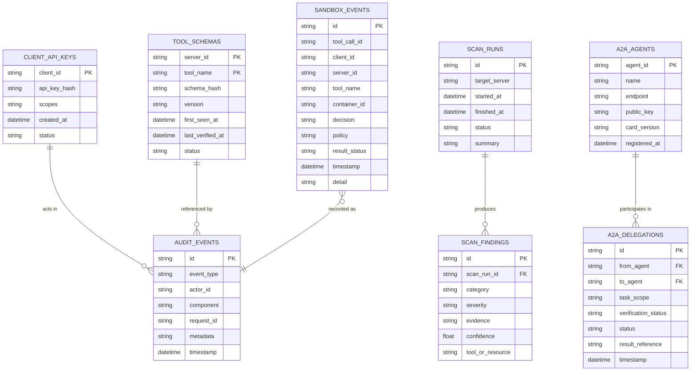

<details>
<summary><b>Table purposes and indexes</b></summary>

<br>

| Table | Purpose |
|-------|---------|
| `client_api_keys` | Client identity and effective scopes. Raw keys are never stored. |
| `tool_schemas` | Trusted schema baselines and version-aware integrity state |
| `scan_runs` | Lifecycle of each scanner execution |
| `scan_findings` | Individual findings with reproducible evidence |
| `sandbox_events` | Container execution and allow/block evidence |
| `a2a_agents` | Public identity information required for delegation |
| `a2a_delegations` | Task lifecycle and verification evidence |
| `audit_events` | Cross-cutting record of security-relevant operations |

| Index | Reason |
|-------|--------|
| `client_api_keys.api_key_hash` (unique) | Fast, unambiguous key lookup |
| `tool_schemas (server_id, tool_name, version)` | Baseline lookup on every call |
| `scan_findings (scan_run_id, severity)` | Report generation |
| `sandbox_events (tool_call_id, timestamp)` | Reconstruct a single call |
| `a2a_delegations (from_agent, to_agent, timestamp)` | Delegation history |
| `audit_events (event_type, timestamp)` | Filtered review |

</details>

**Data lifecycle:** connect and authenticate, discover, verify schema, authorize, sandbox execution, result capture, audit persistence. Scan findings and delegation evidence stay queryable after restart. **Private signing keys and raw API keys never enter the database.**

---

## API reference

Base URL: `/api/v1`. The endpoint names below are the implementation baseline for this project.

<details open>
<summary><b>Endpoints</b></summary>

<br>

**Servers and discovery**

| Method | Path | Purpose |
|:------:|------|---------|
| `GET` | `/servers` | List configured or discovered MCP targets |
| `POST` | `/servers/connect` | Connect, initialise MCP, discover capabilities |
| `GET` | `/servers/:id/tools` | Discovered tools with fingerprint and version state |
| `GET` | `/servers/:id/resources` | Discovered resources and subscription capability |
| `POST` | `/servers/:id/subscriptions` | Create or remove a resource subscription |
| `POST` | `/servers/:id/tools/:tool/invoke` | Invoke a tool through the full pipeline |

**Scanner and audit**

| Method | Path | Purpose |
|:------:|------|---------|
| `POST` | `/scans` | Start a scan against an MCP target |
| `GET` | `/scans/:id` | Scan state, findings and summary |
| `GET` | `/scans/:id/report` | Machine-readable report |
| `GET` | `/audit` | Query persistent security and operational events |

**A2A**

| Method | Path | Purpose |
|:------:|------|---------|
| `GET` | `/a2a/agents` | Configured manager and worker identities and card info |
| `POST` | `/a2a/agents/verify` | Verify the Agent Card and signature |
| `POST` | `/a2a/delegations` | Create a delegation from manager to worker |
| `GET` | `/a2a/delegations/:id` | Delegation state, verification status and result |

**Dashboard and health**

| Method | Path | Purpose |
|:------:|------|---------|
| `GET` | `/events` | SSE stream for Server, Sandbox, Scanner and A2A events |
| `GET` | `/health` | Service health for demos and CI |

</details>

**Invoke a tool**

```http
POST /api/v1/servers/local-notes/tools/notes_read/invoke
X-API-Key: <client key>
Content-Type: application/json

{
  "arguments": { "path": "notes/example.txt" }
}
```

**Standard error**

```json
{
  "error": {
    "code": "SANDBOX_DENIED",
    "message": "Tool execution was blocked because the required sandbox policy could not be established.",
    "requestId": "req_123"
  }
}
```

**Live event envelope (SSE)**

```text
event: sandbox.decision
data: {"requestId":"req_123","tool":"notes_read","decision":"allow",
       "containerId":"c_8f2a","fingerprint":"sha256:9be1…","ts":"2026-09-20T10:14:02Z"}
```

Responses use consistent status codes for validation, authentication, authorization, missing resources, conflicts and server failures, and never expose secrets, stack traces or private key material.

---

## Security design

### Controls by layer

| Layer | Controls |
|-------|----------|
| **Authentication** | Per-client API keys; unknown or missing keys rejected before execution; keys stored only as hashes |
| **Authorization** | Explicit scopes; no wildcard default; missing scope is denied and audited |
| **Data protection** | Hashed keys, private signing keys outside the database and repo, minimum audit metadata, no secrets in logs, HTTPS when exposed beyond a trusted local network |
| **Filesystem** | Approved paths only, read-only where practical, path traversal rejected, no broad host mounts, read-only root filesystem |
| **API** | Input and schema validation, `Origin` validation, safe local binding, rate limiting, secure CORS and headers, dependency and secret scanning in CI |
| **AI** | Tool descriptions, resources and outputs treated as untrusted; model output validated and never authoritative |

### Threat model

Mapped to the OWASP MCP Top 10. That list is a **living beta document**, so the fixture suite pins the exact version and date it was written against.

| Threat | Attack idea | Mitigation | Proof |
|--------|-------------|------------|-------|
| Secret exposure | Credentials leak through logs or context | Hashed keys, minimal persistence | Secret-in-logs test |
| Scope creep | A client gains unintended capability | Per-client scopes | Denied-scope test |
| Tool poisoning | Tool text or outputs steer the model | Fingerprinting, inspection, optional LLM review | Seeded fixture |
| Supply-chain tampering | A dependency or tool changes underneath you | Pinned dependencies, integrity checks | CI plus fixture |
| Command injection | Untrusted input reaches a shell | Validation, sandbox, scanner rule | Seeded injection fixture |
| Intent-flow subversion | Context redirects the agent | Non-authoritative model content, contained execution | Poisoning fixture |
| Missing authentication | Unauthenticated tool access | Key required on every request | Unauthorised request test |
| Audit gaps | No evidence of an action | Persistent events and SSE | Audit reconstruction test |
| Shadow servers | Untracked MCP endpoints | Known target inventory, scanner | Inventory procedure |
| Context over-sharing | Excess data exposed | Scoped resources, arguments and mounts | Access test |

### Responsible disclosure

A scanner that can find bugs in other people's servers carries an obligation. If it finds a real issue in a third-party target:

1. Do **not** publish the target's identity or exploit details, including during demos.
2. Notify the maintainer first.
3. Document the finding internally.
4. Apply a **90-day coordinated-disclosure window**.
5. Disclose publicly only after coordination, or by agreement of an earlier release.

To report a problem in *this* project, please open a private GitHub security advisory rather than a public issue.

---

## Testing strategy

Testing is the proof layer. Each headline claim maps to a test anyone can run.

| Level | What is tested | Pass condition |
|-------|----------------|----------------|
| Unit | Policy, fingerprinting, canonicalisation, scoring | Logic behaves as specified |
| Protocol and transport | Initialise, capabilities, tools, resources, errors, `stdio`, Streamable HTTP | Expected protocol behaviour on both paths |
| Authorization | Valid and invalid keys, scopes | Unauthorised calls rejected |
| Sandbox | Filesystem, privilege and network abuse | No escape in the documented suite |
| Exhaustion | CPU, memory, time abuse | Limits contain and terminate |
| Tamper | Silent change vs version bump | Correctly differentiated |
| Scanner | Seeded OWASP-mapped cases | Zero false negatives on the fixture suite |
| Fuzzing | Malformed and edge input (Hypothesis) | No unexpected crash or broken invariant |
| A2A | Discovery, signing, task lifecycle | One complete delegation cycle |
| Frontend | Event rendering (Vitest, React Testing Library) | UI matches backend events |
| End to end | Connection through execution and delegation | Full demo path passes |
| Optional GenAI | Groundedness, unsupported-claim rate, output validity | Evaluated separately from security |

### Reference test cases

| ID | Scenario | Expected result |
|----|----------|-----------------|
| TEST-001 | MCP initialise and discovery | Expected capabilities and tools are discovered |
| TEST-002 | Invalid API key | Rejected before tool execution |
| TEST-003 | Insufficient tool scope | Denied and audited |
| TEST-004 | Valid sandboxed call | Runs in a container and returns a result |
| TEST-005 | Path, network or privilege escape attempt | Blocked or contained by policy |
| TEST-006 | Silent schema modification | Hash mismatch detected; call held or blocked |
| TEST-007 | Legitimate version-bumped schema | Differentiated from silent tampering |
| TEST-008 | Seeded scanner fixture | Expected finding reported with evidence |
| TEST-009 | Malformed or edge input | No crash or invariant break |
| TEST-010 | Manager to worker task | One complete verified delegation |

### Traceability

| Requirement | Capability | Technical | Component | Data | Test |
|-------------|------------|-----------|-----------|------|------|
| BR-001 | Real MCP capability | TR-001, 002 | MCP server and client | `tool_schemas` | TEST-001 |
| BR-002 | Dynamic discovery | TR-001, 002 | Connect and discovery | `tool_schemas` | TEST-001 |
| BR-003 | Sandbox | TR-005 | Sandbox orchestrator | `sandbox_events` | TEST-004, 005 |
| BR-004 | Tamper detection | TR-004 | Integrity layer | `tool_schemas` | TEST-006, 007 |
| BR-005 | Scanner | TR-006 | Scanner CLI and API | `scan_runs`, `scan_findings` | TEST-008 |
| BR-006 | Auth and scopes | TR-003 | Auth and policy | `client_api_keys` | TEST-002, 003 |
| BR-007 | A2A delegation | TR-009 | Manager and worker | `a2a_agents`, `a2a_delegations` | TEST-010 |
| BR-008 | Persistent audit | TR-007 | Audit and database | `audit_events` | Restart persistence test |
| BR-009 | Live views | TR-008 | SSE and React | event references | Frontend integration |
| BR-010 | Reproducible validation | TR-010 | Fixtures and CI | test artifacts | Full CI suite |

### Fixture design

Fixtures live as code and data. Each has a **seed**, an **expected category**, **expected evidence**, an **expected severity** and an **expected scanner behaviour**, which keeps the demo repeatable rather than staged.

---

## Delivery pipeline

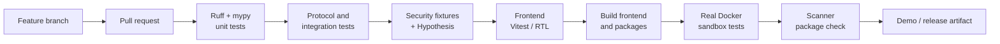

**Quality gates.** A change does not merge when required tests fail, a secret is detected, the sandbox tests are broken, a schema migration is missing, or a security-related change has no verification path.

| Concern | Choice |
|---------|--------|
| Dependencies | `uv` or Poetry |
| Lint and format | Ruff |
| Types | mypy |
| Testing | pytest, pytest-asyncio, Hypothesis |
| Logging | structlog |
| Local orchestration | Honcho and a `Procfile` |
| CI | GitHub Actions with Docker-in-Docker for real sandbox coverage |
| Scanner packaging | Hatch |
| Load testing | Locust (stretch goal) |

Branching: `main` is stable and demo-ready, `feature/*` branches are short-lived, and `develop` is optional. Pull requests state the requirement addressed, an implementation summary, tests performed, the security effect, screenshots for UI changes and known limitations.

---

## Observability

A reviewer should be able to connect one frontend action to the backend security decision and the final result.

<table>
<tr>
<td valign="top" width="50%">

**Structured log fields**

- Request ID
- Client ID and effective scope
- Server ID and transport
- Tool name and tool-call ID
- Schema version and fingerprint state
- Container ID and sandbox decision
- Scan run ID and finding count
- A2A delegation or task ID and verification status
- Error code and timestamp

Raw API keys, private signing keys and unnecessary external content are **never** logged.

</td>
<td valign="top" width="50%">

**Metrics**

- MCP request count and latency
- Authentication and authorization denials
- Sandbox duration and cleanup failures
- Blocked filesystem, network and privilege attempts
- Scanner duration and findings by category and severity
- SSE delivery status
- A2A delegation duration and failures
- Optional LLM latency and backend usage

</td>
</tr>
</table>

**Trace path:** frontend, FastAPI, authentication and scopes, MCP discovery, schema integrity, sandbox, audit persistence, SSE, frontend. For A2A: manager, card verification, worker, result, audit.

**Alerts:** repeated sandbox creation or cleanup failures, unexpected fingerprint changes, repeated auth or scope failures, scanner failures, database or migration failures, repeated signature verification failures, and LLM dependency failures when that feature is on.

---

## Cost

The project is free-first by design. SQLite needs no database service, Docker or OrbStack runs locally, and every deterministic control works without a paid model. If a hosted LLM is ever chosen, the cost model is:

```text
monthly LLM cost = requests × avg input tokens × input price
                 + requests × avg output tokens × output price
```

No prices are quoted here because no provider has been selected. Keep deterministic checks offline, use the model only where it adds reviewer value, prefer small local models for the demo, and send narrow evidence slices instead of whole servers.

---

## Quick start

**Prerequisites:** Python 3.11+, Node 18+, and a Docker-compatible runtime (Docker Engine, Docker Desktop or OrbStack). Ollama is only needed for optional LLM features. **No GPU required.**

```bash
# 1. Clone
git clone https://github.com/aneek22112007-tech/mcp-a2a-secure.git
cd mcp-a2a-secure

# 2. Install backend and frontend dependencies
uv sync                        # or: pip install -e ".[dev]"
npm --prefix frontend install

# 3. Generate local secrets (kept out of Git)
python scripts/gen_keys.py     # client API keys and A2A signing keys

# 4. Create the database
alembic upgrade head

# 5. Start everything (API, A2A worker, frontend dev server)
honcho start
```

Open the console at `http://localhost:5173`.

```bash
pytest                         # unit, protocol, security, sandbox
pytest -m sandbox              # real Docker sandbox suite only
mcp-a2a-scan --help            # standalone scanner
```

<details>
<summary><b>Typical configuration</b></summary>

<br>

| Setting | Purpose |
|---------|---------|
| `DATABASE_URL` | SQLite location (`sqlite+aiosqlite:///./data/app.db`) |
| `API_KEYS_FILE` | Local file holding client key hashes and scopes |
| `A2A_PRIVATE_KEY_PATH` | Ignored local path for the worker's Ed25519 key |
| `SANDBOX_MEM_LIMIT`, `SANDBOX_CPU`, `SANDBOX_PIDS` | Container resource limits |
| `LLM_BACKEND` | `ollama` (default), `groq` or `none` |
| `OLLAMA_MODEL` | Local model for optional features |
| `ALLOWED_ORIGINS` | Origins accepted for HTTP transport and CORS |

Raw API keys and private keys must never be committed. Only key hashes and public keys are persisted.

</details>

<details>
<summary><b>Repository layout</b></summary>

<br>

```text
mcp-a2a-secure/
├── app/                # Backend (modules listed in the LLD)
├── scanner/            # Standalone scanner package (Hatch)
├── fixtures/           # Seeded vulnerable targets
├── frontend/           # React application
├── migrations/         # Alembic
├── tests/
├── scripts/
├── docs/               # Design set, ADRs, diagrams
├── .github/workflows/
├── Procfile
├── pyproject.toml
└── README.md
```

</details>

---

## Demo script

The final presentation proves the thesis in a deliberate order rather than showing unrelated screens.

| Step | Action | Evidence shown |
|:----:|--------|----------------|
| 1 | Show the architecture and feature map | Boundaries are understood |
| 2 | Connect a real MCP client | Discovery and tools visible |
| 3 | Call a normal tool | Successful MCP flow |
| 4 | Show the sandbox event | Container, policy and result |
| 5 | Attempt an unsafe action | Denied or contained |
| 6 | Modify a schema silently | Tamper alert |
| 7 | Run the scanner on a seeded target | Finding with evidence |
| 8 | Open the Scanner view | Live findings |
| 9 | Start manager and worker | Independent agents |
| 10 | Run A2A delegation | Agent Card and task cycle |
| 11 | Show the audit trail | Persistent evidence |
| 12 | Run the fixture suite | Reproducible metrics |

---

## Roadmap

A 12-week plan for a team of two. Weeks 9 and 10 are paired on purpose, because delegation and signing are the least familiar and highest-risk part. The build order is intentional: a demoable UI on mock data first, then the riskiest backend pieces behind stable interfaces.

| Week | Focus | Deliverable | Status |
|:----:|-------|-------------|:------:|
| 1 | Setup and frontend shell | Repo, CI skeleton, target tool decided, navigation | ☐ |
| 2 | Frontend views | Four views on mock data | ☐ |
| 3 | MCP server and client | Real tool, discovery, API-key auth | ☐ |
| 4 | Sandbox core | Docker orchestration, network isolation, limits | ☐ |
| 5 | Sandbox hardening | Escape and exhaustion tests, policy refinement | ☐ |
| 6 | Scanner core | CLI, deterministic rules, fingerprinting, fixtures | ☐ |
| 7 | Scanner integration | SQLite persistence, live Scanner view | ☐ |
| 8 | LLM layer | Ollama, `LLMBackend`, optional analysis | ☐ |
| 9 | A2A foundation | Worker Agent Card, signing and verification | ☐ |
| 10 | A2A demo | Manager to worker lifecycle, graph view | ☐ |
| 11 | Testing and docs | Threat model, fixture suite, CI hardening, scanner packaging | ☐ |
| 12 | Polish and demo | Bug fixes, final evidence, video, buffer | ☐ |

**Future scope:** broader scanner coverage and deeper static analysis, stronger aggregation and server inventory, A2A 1.0-strict signing, richer subscription scenarios, enterprise identity and tenant isolation, load testing and horizontal workers, expanded alerting, and more LLM providers behind the existing abstraction.

---

## Definition of done

| Area | Done when |
|------|-----------|
| MCP | A real client discovers the server and the intended tools are callable |
| Transport | Supported paths are documented and tested with current terminology |
| Auth | Invalid keys and insufficient scopes are rejected |
| Sandbox | No privilege, filesystem or network escape in the documented suite |
| Tamper | Silent change detected; version bump handled correctly |
| Scanner | Zero false negatives against the documented fixture suite |
| A2A | One complete manager to worker cycle demonstrated |
| Frontend | Four views show real events |
| Database | Required state and audit records persist |
| CI | Automated tests run with real Docker sandbox coverage |
| Docs | Architecture, threat model, setup, limitations, disclosure and demo steps complete |
| Packaging | Scanner installs as a standalone package |

---

## What this project does not claim

Security projects tend to fail by overclaiming, so the limits are stated plainly.

- The scanner reports **zero false negatives on its documented fixture suite**. That is a bounded statement, not a claim about the real MCP ecosystem.
- The sandbox **reduces risk**. It does not make arbitrary hostile code safe.
- API-key scopes demonstrate least privilege. They are **not** enterprise IAM.
- Detached Ed25519 signing is a **project mechanism**, not the A2A standard. A2A 1.0 describes JWS for Agent Cards.
- The LLM is optional and never authoritative for a dangerous action.
- OrbStack is a local convenience, not a deployment dependency.
- No performance figures are quoted, because none have been measured.

---

## Decisions and compatibility notes

<details>
<summary><b>Architecture decision records</b></summary>

<br>

| ADR | Decision | Rationale | Trade-off |
|-----|----------|-----------|-----------|
| 001 | FastAPI with the official Python MCP SDK | One coherent Python ecosystem, less custom protocol code | Frontend is a separate TypeScript app |
| 002 | Docker Engine API as the sandbox target | Portable, clear execution boundary | Container start-up overhead; policy still needs careful testing |
| 003 | SQLite, SQLAlchemy, Alembic | Zero-infrastructure persistence with explicit migrations | Not built to prove multi-node database behaviour |
| 004 | Deterministic controls before any LLM | Testable, works offline and free | Some nuanced analysis still needs human review |
| 005 | API-key scopes and project-specific A2A signing | Understandable and testable within 12 weeks | Not enterprise IAM; signing needs alignment for strict A2A 1.0 interop |

</details>

<details>
<summary><b>Known inconsistencies in the source material, and how they are resolved</b></summary>

<br>

| Topic | Earlier source | Final source | Treatment |
|-------|----------------|--------------|-----------|
| Timeline | 6 to 8 weeks vs 12 weeks was an open mentor question | 12-week plan, marked resolved | Use 12 weeks; keep the note |
| Target tool | Shortlist of filesystem or notes, GitHub issues, internal REST API | Recommends a local filesystem or notes tool | Use it; confirm before Week 1 |
| HTTP transport | "HTTP/SSE" | Streamable HTTP in current MCP docs | Use current terminology |
| A2A signing | Ed25519 detached JSON signature | A2A 1.0 describes JWS | Project mechanism; align for strict interop |
| OWASP list | "OWASP MCP Top 10" | Currently a living beta | Pin the exact version and date |

</details>

<details>
<summary><b>Glossary</b></summary>

<br>

| Term | Meaning |
|------|---------|
| **MCP** | Model Context Protocol: standard integration between an AI application and tools or data |
| **A2A** | Agent2Agent Protocol: standard interoperability between agents |
| **Host / client / server** | The application, the connector inside it, and the service exposing tools |
| **Tool** | A callable function exposed through MCP |
| **Resource** | URI-addressable contextual data exposed through MCP |
| **Capability negotiation** | Exchange of supported optional features during initialisation |
| **Sandbox** | Isolated runtime boundary around tool execution |
| **Least privilege** | Only the permissions the current client, tool or task needs |
| **Rug pull** | Silent redefinition of a previously trusted tool or schema |
| **Fingerprint** | Hash used to detect changes to a definition |
| **TOFU** | Trust on first use: the first-seen fingerprint becomes the baseline |
| **Fixture** | Controlled target with a known seeded vulnerability |
| **Agent Card** | A2A metadata document describing an agent |
| **Task / Artifact** | A2A unit of work with a lifecycle, and its output |
| **SSE** | Server-Sent Events: one-way HTTP event streaming |
| **LLMBackend** | Project abstraction that makes model providers swappable |

</details>

---

## Team

Built for the Generative AI track of the OJT programme over 12 weeks.

<table>
<tr>
<td width="50%" valign="top">

**Aneek Das**<br>
<sub>Backend and infrastructure</sub>

MCP server and client, authentication and policy, Docker sandbox and hardening, scanner, schema integrity, database, backend tests and CI sandbox coverage.

</td>
<td width="50%" valign="top">

**Priyanshu Dwivedi**<br>
<sub>Frontend, LLM and A2A integration</sub>

React console and four live views, SSE integration, `LLMBackend` and Ollama, A2A manager and worker, graph view, frontend tests and demo integration.

</td>
</tr>
</table>

**Shared:** the Week 9 to 10 A2A pairing, threat model and security review, fixture suite and final testing, documentation, and the final demo.

---

## References

- [Model Context Protocol specification](https://modelcontextprotocol.io)
- [Agent2Agent (A2A) Protocol](https://a2a-protocol.org)
- [OWASP MCP Top 10](https://owasp.org)

<div align="center">

<sub>A student security and interoperability project.<br>Every claim in this repository is bounded by the test that backs it.</sub>

<br><br>


</div>
