# mermaid test

## A emoji

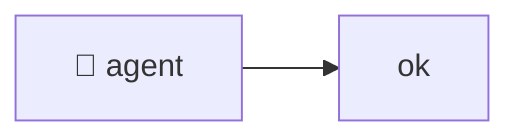
```mermaid
flowchart LR
    A["🤖 agent"] --> B["ok"]
```

## B middot

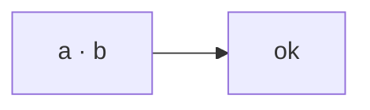
```mermaid
flowchart LR
    A["a · b"] --> B["ok"]
```

## C arrow

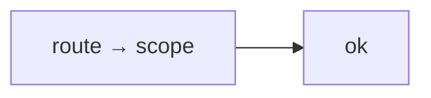
```mermaid
flowchart LR
    A["route → scope"] --> B["ok"]
```

## D seq ellipsis le

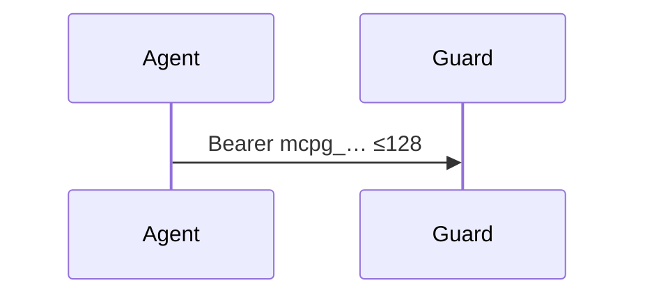
```mermaid
sequenceDiagram
    participant A as Agent
    participant B as Guard
    A->>B: Bearer mcpg_… ≤128
```

## E dasharray

```mermaid
flowchart LR
    A --> B
    classDef p fill:#1e1b3a,stroke:#a78bfa,stroke-dasharray:5 5
    class A p
```

## F slash label

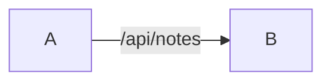
```mermaid
flowchart LR
    A -->|"/api/notes"| B
```

## G br

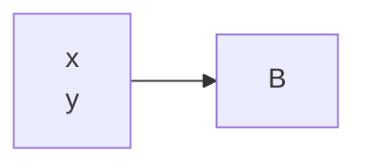
```mermaid
flowchart LR
    A["x<br/>y"] --> B
```

## H plain seq

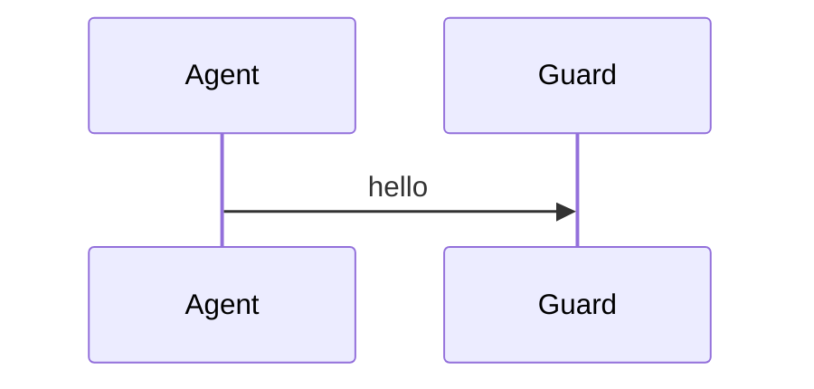
```mermaid
sequenceDiagram
    participant A as Agent
    participant B as Guard
    A->>B: hello
```

## I stadium hex

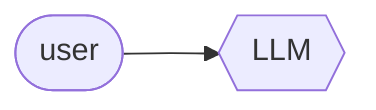
```mermaid
flowchart LR
    U(["user"]) --> L{{"LLM"}}
```

## J cyl

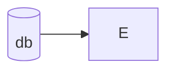
```mermaid
flowchart LR
    D[("db")] --> E
```

## K quote in label

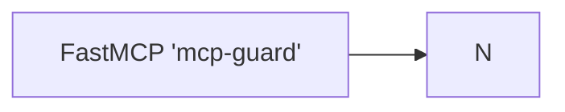
```mermaid
flowchart LR
    M["FastMCP 'mcp-guard'"] --> N
```

## L seq emoji

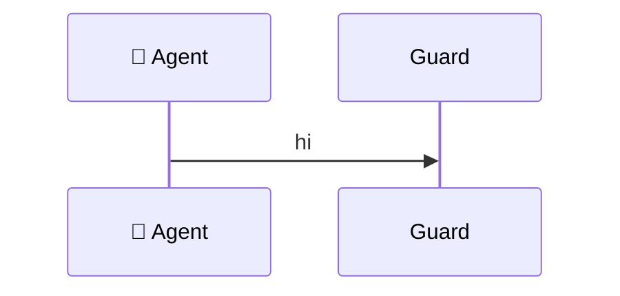
```mermaid
sequenceDiagram
    participant A as 🤖 Agent
    participant B as Guard
    A->>B: hi
```
