# mermaid test 5

### N0 AG

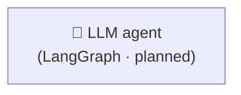
```mermaid
flowchart LR
    AG["🤖 LLM agent<br/>(LangGraph · planned)"]
```

### N1 UI

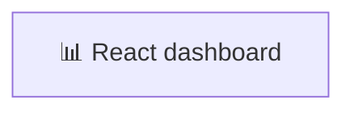
```mermaid
flowchart LR
    UI["📊 React dashboard"]
```

### N2 A2A

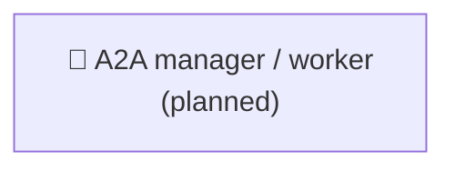
```mermaid
flowchart LR
    A2A["🤝 A2A manager / worker<br/>(planned)"]
```

### N3 INS

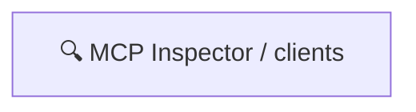
```mermaid
flowchart LR
    INS["🔍 MCP Inspector / clients"]
```

### N4 MW

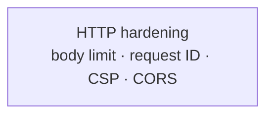
```mermaid
flowchart LR
    MW["HTTP hardening<br/>body limit · request ID · CSP · CORS"]
```

### N5 AUTH

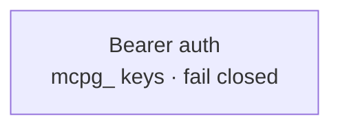
```mermaid
flowchart LR
    AUTH["Bearer auth<br/>mcpg_ keys · fail closed"]
```

### N6 SC

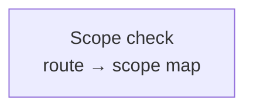
```mermaid
flowchart LR
    SC["Scope check<br/>route → scope map"]
```

### N7 GW

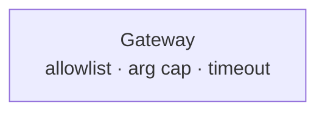
```mermaid
flowchart LR
    GW["Gateway<br/>allowlist · arg cap · timeout"]
```

### N8 SCAN

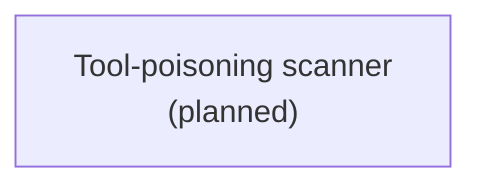
```mermaid
flowchart LR
    SCAN["Tool-poisoning scanner<br/>(planned)"]
```

### N9 AUD

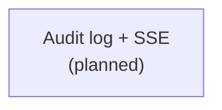
```mermaid
flowchart LR
    AUD["Audit log + SSE<br/>(planned)"]
```

### N10 RL

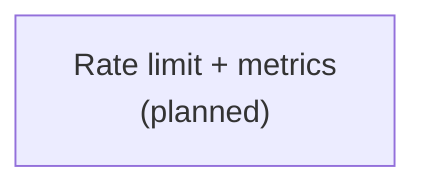
```mermaid
flowchart LR
    RL["Rate limit + metrics<br/>(planned)"]
```

### N11 MCP

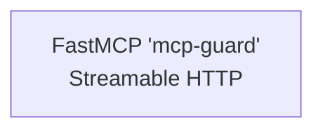
```mermaid
flowchart LR
    MCP["FastMCP 'mcp-guard'<br/>Streamable HTTP"]
```

### N12 T1

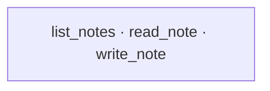
```mermaid
flowchart LR
    T1["list_notes · read_note · write_note"]
```

### N13 DB

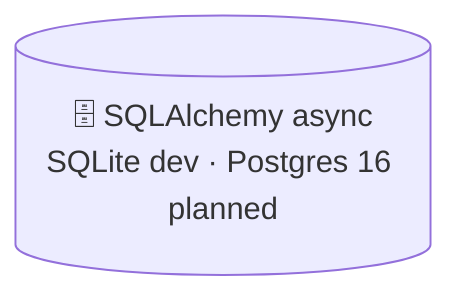
```mermaid
flowchart LR
    DB[("🗄️ SQLAlchemy async<br/>SQLite dev · Postgres 16 planned")]
```

### S0

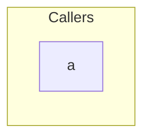
```mermaid
flowchart LR
    subgraph CALLERS["Callers"]
        x1["a"]
    end
```

### S1

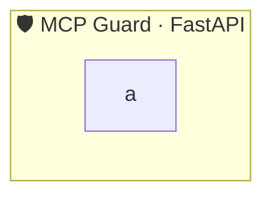
```mermaid
flowchart LR
    subgraph GUARD["🛡️ MCP Guard · FastAPI"]
        x1["a"]
    end
```

### S2

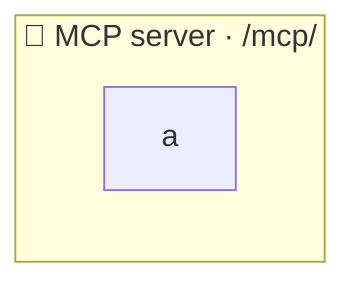
```mermaid
flowchart LR
    subgraph TOOLS["🔧 MCP server · /mcp/"]
        x1["a"]
    end
```
