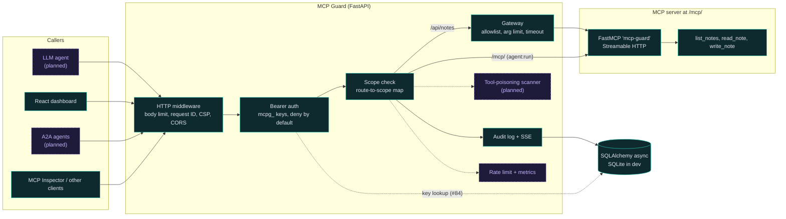
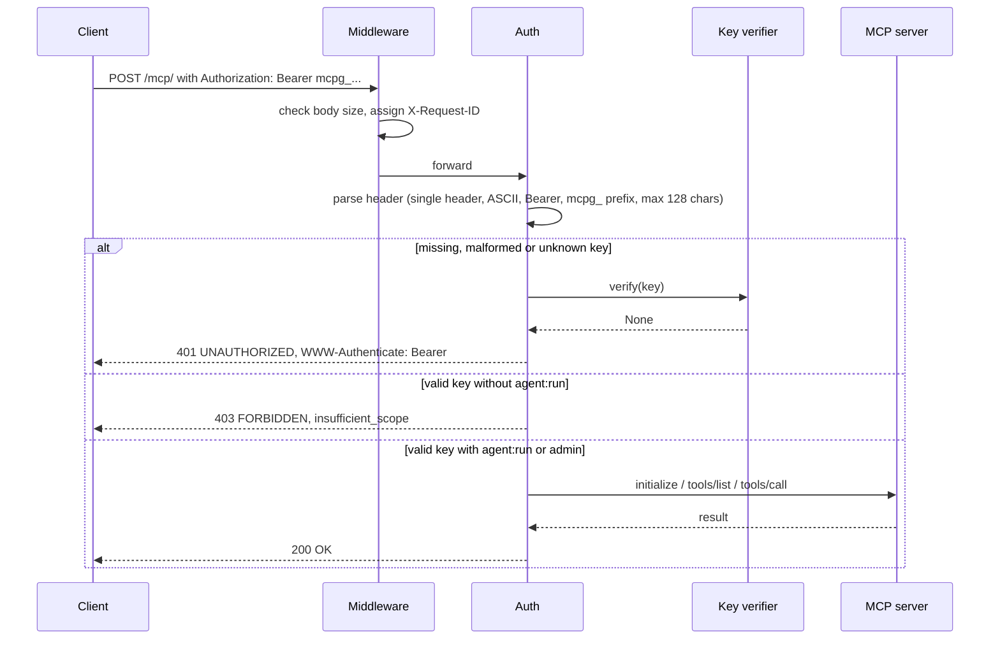
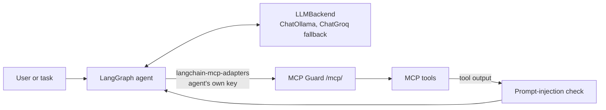

# MCP Guard

MCP Guard is an authenticating gateway for [Model Context Protocol](https://modelcontextprotocol.io) (MCP) tools. It is a FastAPI app that hosts an MCP server at `/mcp/` and a small REST API. Before a request reaches a tool, MCP Guard checks the caller's Bearer API key and the scopes attached to it.

Most MCP servers trust whoever can reach them. We wanted a place to enforce who is calling and what they may do, and later to put LLM agents behind the same checks so an agent gets the access its key allows and nothing more. This is our OJT 2026 project on the Generative AI track.

[](api/pyproject.toml)
[](https://fastapi.tiangolo.com)
[](https://modelcontextprotocol.io)
[](frontend/package.json)
[](api/app/config.py)
[](LICENSE)
[](#team)

> [!NOTE]
> `main` currently ships a deny-all key verifier. Until key storage and verification land in [#84](https://github.com/aneek22112007-tech/mcp-a2a-secure/pull/84), every protected route and `/mcp/` returns 401. That is on purpose: the gateway refuses anything it can't verify.

## How a request flows

<p align="center">
  
</p>

The diagram loops through three cases. A key with the right scope reaches the tool. A request with no key is stopped at the auth step with a 401. A valid key without the needed scope is stopped at the scope check with a 403. The scanner step is dashed because it is not built yet. Audit logging is implemented.

## Architecture


```mermaid
flowchart LR
    subgraph CALLERS["Callers"]
        direction TB
        AG["LLM agent<br/>(planned)"]
        UI["React dashboard"]
        A2A["A2A agents<br/>(planned)"]
        INS["MCP Inspector / other clients"]
    end

    subgraph CORE["MCP Guard (FastAPI)"]
        direction TB
        MW["HTTP middleware<br/>body limit, request ID, CSP, CORS"]
        AUTH["Bearer auth<br/>mcpg_ keys, deny by default"]
        SC["Scope check<br/>route-to-scope map"]
        GW["Gateway<br/>allowlist, arg limit, timeout"]
        SCAN["Tool-poisoning scanner<br/>(planned)"]
        AUD["Audit log + SSE"]
        RL["Rate limit + metrics"]
    end

    subgraph TOOLS["MCP server at /mcp/"]
        direction TB
        MCP["FastMCP 'mcp-guard'<br/>Streamable HTTP"]
        T1["list_notes, read_note, write_note"]
    end

    DB[("SQLAlchemy async<br/>SQLite in dev")]

    AG --> MW
    UI --> MW
    A2A --> MW
    INS --> MW
    MW --> AUTH --> SC
    SC -->|"/api/notes"| GW --> MCP
    SC -->|"/mcp/ (agent:run)"| MCP
    MCP --> T1
    SC -.-> SCAN
    SC --> AUD
    SC -.-> RL
    AUTH -.->|"key lookup (#84)"| DB
    AUD --> DB

    classDef built fill:#0f2a2e,stroke:#2dd4bf,color:#e2e8f0
    classDef planned fill:#1e1b3a,stroke:#a78bfa,color:#c4b5fd,stroke-dasharray:5 5
    class MW,AUTH,SC,GW,MCP,T1,UI,INS,DB,AUD built
    class SCAN,RL,AG,A2A planned
```

Dashed nodes and edges are planned. REST calls to `/api/notes` go through the gateway. MCP clients talk to the MCP server directly once they pass auth and the `agent:run` scope check. Audit rows are written for auth decisions and tool calls.

### Request sequence


```mermaid
sequenceDiagram
    participant C as Client
    participant M as Middleware
    participant G as Auth
    participant V as Key verifier
    participant S as MCP server

    C->>M: POST /mcp/ with Authorization: Bearer mcpg_...
    M->>M: check body size, assign X-Request-ID
    M->>G: forward
    G->>G: parse header (single header, ASCII, Bearer, mcpg_ prefix, max 128 chars)
    alt missing, malformed or unknown key
        G->>V: verify(key)
        V-->>G: None
        G-->>C: 401 UNAUTHORIZED, WWW-Authenticate: Bearer
    else valid key without agent:run
        G-->>C: 403 FORBIDDEN, insufficient_scope
    else valid key with agent:run or admin
        G->>S: initialize / tools/list / tools/call
        S-->>G: result
        G-->>C: 200 OK
    end
```

A malformed header is rejected before the verifier is called. Missing, malformed and unknown keys all get the same 401 body, so the response can't be used to probe for valid keys.

## Features

On `main` today:

- **MCP server.** Built on the official Python SDK (FastMCP) and mounted at `/mcp/` over Streamable HTTP. It exposes three notes tools, `list_notes`, `read_note` and `write_note`. Note names are checked against `[A-Za-z0-9_-]{1,64}` and the resolved path must stay inside the notes directory.
- **Notes REST API.** `/api/notes` routes call tools only through `gateway.call_tool()`, which applies a tool allowlist, a 128 KiB argument limit, a 5 second timeout and error messages that don't leak paths or tracebacks.
- **API-key auth and scopes.** Protected REST routes and `/mcp/` need `Authorization: Bearer mcpg_...`. Scopes are `notes:read`, `notes:write`, `audit:read`, `metrics:read`, `agent:run` and `admin`. The key verifier is pluggable and defaults to deny-all. Every route has to appear in the scope map or the app fails at startup.
- **Consistent errors.** 401, 403 and other errors use one JSON shape and include `WWW-Authenticate` where it applies.
- **HTTP hardening.** Request IDs on every response and log line, a request body size limit, security headers with a strict CSP, a CORS allowlist, and API docs disabled outside development.
- **Status endpoint.** `/api/status` does a real MCP handshake against the server and reports latency, protocol version and tools.
- **Database layer.** SQLAlchemy 2 (async) with Alembic migrations and repositories. Tables exist for clients, API keys, audit events and sandbox runs. SQLite is used in development.
- **Audit log.** Every tool call and every auth decision is written to `audit_events`. `GET /api/audit` lists rows newest-first. `GET /api/audit/stream` is a live SSE feed for `audit:read`. Mutating REST calls (`PUT /api/notes/{name}`) and MCP `tools/call` are audit-first: a required row is written before the tool runs. Read tools are audited after execution, before the result is returned. Auth allow and deny are best-effort, so a 401 or 403 stays a 401 or 403.
- **Rate limiting, metrics and retention.** Each API key has its own token bucket, with separate buckets for REST and `/mcp`. A limited request gets 429 `RATE_LIMITED` and a `Retry-After` header. `GET /api/metrics` (`metrics:read`) reports database totals and in-process counters. Old audit rows are removed by `scripts/prune_audit.py`, with an optional scheduler.
- **Docker sandbox.** `list_notes`, `read_note` and `write_note` run in a container with a read-only root, no capabilities, no network, a non-root user, and memory, CPU, pid and file-size limits. The container sees only the notes directory. If Docker or the runner image is unavailable, the call fails with 503 and is not run in the API process. `SANDBOX_MODE=inprocess` is for local development and tests. A production-like environment rejects it.
- **Frontend.** React 19, Vite and Tailwind. The Server Status view at `/dashboard-v2` reads `/api/status`. The other dashboard panels still use mock data.

## Status

Planned for v1.0 (target 31 October 2026):

- Tool schema fingerprinting and pinning, so a changed tool definition is held until someone approves it again.
- A rule-based tool-poisoning scanner, followed by an LLM-assisted version.
- The GenAI work described below.
- Docker Compose with PostgreSQL 16.

## GenAI plans

None of this is built yet.

Agents will be ordinary MCP Guard clients. Each agent gets its own API key and scopes and reaches tools only through `/mcp/`, like any other client.

- A LangGraph agent built with LangChain. The model sits behind an `LLMBackend` interface, with ChatOllama (local) as the primary backend and ChatGroq as the fallback.
- Tools are loaded with `langchain-mcp-adapters`, pointed at MCP Guard's `/mcp/` endpoint and using the agent's key.
- Tool output passes through a prompt-injection check before it goes back to the model.
- LLM-written explanations of schema changes and scanner findings, plus an assistant in the dashboard for reviewing audit events.
- A2A manager and worker agents built with LangGraph, each with its own key.


```mermaid
flowchart LR
    U["User or task"] --> AG["LangGraph agent"]
    AG <--> LLM["LLMBackend<br/>ChatOllama, ChatGroq fallback"]
    AG -->|"langchain-mcp-adapters<br/>agent's own key"| MG["MCP Guard /mcp/"]
    MG --> T["MCP tools"]
    T -->|"tool output"| PI["Prompt-injection check"]
    PI --> AG
```

The LLM is never the final security authority. Authentication, scope checks, fingerprint comparisons and scanner rules are plain code. Model output can explain something or flag it for a person to review, but it can't grant a scope, approve a changed schema or switch off a check. If the model is down, enforcement still works.

## Security notes

- **Fail closed.** The default verifier denies every key. A route missing from the scope map stops the app from starting, and returns 403 if it is somehow reached. If the verifier raises an error on `/mcp/`, the client gets a generic 500 and the request goes no further.
- **No key enumeration.** Missing, malformed and unknown keys get the same 401 body. A 403 carries `WWW-Authenticate: Bearer error="insufficient_scope"` and names the missing scope.
- **Secrets stay out of logs.** Auth logs record a deny reason (`missing`, `malformed` or `rejected`) or the key prefix, never the key or its hash. Only key hashes are stored. `MCP_SELF_API_KEY` is held as a `SecretStr`.
- **Strict header parsing.** Exactly one `Authorization` header, ASCII only, in the form `Bearer <token>` with no extra spaces. The token must start with `mcpg_` and be at most 128 characters. An `X-Request-ID` that doesn't match `[A-Za-z0-9._:-]` (up to 64 characters) is replaced with a UUID.
- **Other headers and limits.** `Content-Length` is validated and the body is capped while streaming (413 when exceeded). Responses carry `Content-Security-Policy: default-src 'none'; frame-ancestors 'none'`, `X-Frame-Options: DENY`, `X-Content-Type-Options: nosniff`, `Referrer-Policy: no-referrer` and `Cache-Control: no-store` on every response. `Strict-Transport-Security` is sent when `HSTS_MAX_AGE_S` is greater than zero.
- **Postgres append-only audit log.** On Postgres, a database-level trigger prevents UPDATE, DELETE and TRUNCATE on `audit_events`. Retention is the only permitted delete (gated by `SET LOCAL mcp_guard.audit_retention = 'on'`). The `api_key_id` ON DELETE SET NULL update is allowed. SQLite uses an ORM-level guard only; a database owner can disable triggers, so production should run as a non-owner role.
- **Reverse proxy IP handling.** When `TRUSTED_PROXIES` is set, the real client IP is extracted from a single `X-Forwarded-For` header by walking right-to-left past trusted addresses. Without `TRUSTED_PROXIES`, `X-Forwarded-For` is ignored entirely.
- **Failed-auth throttle.** Repeated 401 outcomes from the same client IP are counted in a fixed window. After `AUTH_FAILURE_LIMIT` failures, every further request to that IP returns 429 with `Retry-After` until the window resets. Only 401 outcomes count; 403 and success never increment or reset the counter.

The full threat model is in [docs/THREAT_MODEL.md](docs/THREAT_MODEL.md).

## Getting started

You need Python 3.11+, [uv](https://docs.astral.sh/uv/), and Node 20.19+ or 22.12+ (Vite 8 requires it).

```bash
git clone https://github.com/aneek22112007-tech/mcp-a2a-secure.git
cd mcp-a2a-secure/api

cp .env.example .env              # settings are read from api/.env
uv sync
uv run alembic upgrade head       # creates the SQLite database in api/data/
uv run python scripts/seed_dev.py # optional: adds dev clients, no keys

uv run uvicorn app.main:app --reload --host 127.0.0.1 --port 8000 --log-config log_config.json
```

The API is at `http://127.0.0.1:8000` and the MCP endpoint at `http://127.0.0.1:8000/mcp/`. Swagger UI is at `/docs` when `ENVIRONMENT` is `dev`, `development` or `local`.

Frontend, in a second terminal:

```bash
cd frontend
npm install
npm run dev                       # http://localhost:5173, live status at /dashboard-v2
```

To try the tools without auth, run the server over stdio with MCP Inspector:

```bash
cd api
npx @modelcontextprotocol/inspector uv run python -m app.mcp_server
```

## API

| Method | Path | Scope | Description |
|---|---|---|---|
| `GET` | `/health` | public | Liveness check |
| `GET` | `/api/status` | public | MCP handshake against `MCP_SELF_URL`. Reports `online` only when `MCP_SELF_API_KEY` is set to a key with `agent:run` |
| `GET` | `/api/mcp/info` | public | Server name, transport, endpoint and tool names |
| `GET` | `/api/notes` | `notes:read` | List notes |
| `GET` | `/api/notes/{name}` | `notes:read` | Read a note |
| `PUT` | `/api/notes/{name}` | `notes:write` | Create or overwrite a note. Body `{"content": "..."}`, up to 100 KiB |
| `POST`, `GET`, `DELETE` | `/mcp/` | `agent:run` | MCP Streamable HTTP (`initialize`, `tools/list`, `tools/call`) |
| `GET` | `/api/audit` | `audit:read` | Audit events, newest first |
| `GET` | `/api/audit/stream` | `audit:read` | Live SSE stream of audit events. The key is sent only in the `Authorization` header |
| `GET` | `/api/metrics` | `metrics:read` | Returns database totals and in-process rate limit counters |
| `POST` | `/api/keys` | `admin` | Create an API key. The raw key is returned once |
| `GET` | `/api/keys` | `admin` | List keys for a client (`client_id` query parameter) |
| `DELETE` | `/api/keys/{key_id}` | `admin` | Revoke a key |
| `GET` | `/docs`, `/redoc`, `/openapi.json` | public, dev only | Disabled outside development |

Gateway errors map to 400 (bad arguments), 404 (unknown tool or note), 413 (too large), 503 (sandbox unavailable) and 504 (tool timeout).

### Scopes

| Scope | Allows |
|---|---|
| `notes:read` | Listing and reading notes |
| `notes:write` | Creating and overwriting notes |
| `agent:run` | Everything under `/mcp/` |
| `audit:read` | `GET /api/audit` and `GET /api/audit/stream` |
| `metrics:read` | `GET /api/metrics` |
| `admin` | Passes every scope check |

The route-to-scope map lives in [`api/app/auth/scopes.py`](api/app/auth/scopes.py).

<details>
<summary><b>Configuration</b> (<code>api/.env</code>)</summary>

<br>

| Variable | Default | Description |
|---|---|---|
| `APP_NAME` | `MCP Guard` | Display name |
| `ENVIRONMENT` (or `APP_ENV`) | `dev` | Trimmed and lowercased. `dev`, `development` and `local` enable `/docs`, `/redoc` and `/openapi.json`. Any value other than `dev`, `development`, `local` or `test` is production-like: `API_KEY_PEPPER` is required and `CORS_ORIGINS` must be exact http/https origins |
| `CORS_ORIGINS` | `["http://localhost:5173"]` | JSON list of allowed origins |
| `TRUSTED_PROXIES` | `[]` | JSON list of trusted proxy IPs or CIDRs. When set, the real client IP is resolved from `X-Forwarded-For` |
| `HSTS_MAX_AGE_S` | `0` | `max-age` for `Strict-Transport-Security`. Set to a positive integer (e.g. `31536000`) to enable HSTS |
| `AUTH_FAILURE_LIMIT` | `20` | Failed 401 attempts per IP before throttling (429) |
| `AUTH_FAILURE_WINDOW_S` | `60` | Fixed window length in seconds for the failed-auth counter |
| `AUTH_FAILURE_MAX_TRACKED_IPS` | `10000` | Maximum number of IPs tracked by the throttle (LRU eviction) |
| `MCP_SELF_URL` | `http://127.0.0.1:8000/mcp/` | URL probed by `/api/status` |
| `MCP_SELF_API_KEY` | unset | `mcpg_` key with `agent:run`, used only by the status probe |
| `DATABASE_URL` | `sqlite+aiosqlite:///<api>/data/mcp_guard.db` | Async SQLAlchemy URL |
| `NOTES_DIR` | `api/data/notes` | Where notes are stored as `.md` files |
| `MAX_BODY_BYTES` | `1048576` | Request body limit (1 MiB) |
| `TOOL_TIMEOUT_S` | `5` | Gateway tool timeout in seconds. Must be greater than `SANDBOX_TIMEOUT_S` |
| `SANDBOX_MODE` | `docker` | `docker` runs each tool in a container. `inprocess` runs it in the API process and is rejected when the environment is production-like |
| `SANDBOX_IMAGE` | `mcp-guard-tool-runner:local` | Runner image. Build it with `api/scripts/build_sandbox_image.sh` |
| `SANDBOX_TIMEOUT_S` | `4` | Seconds to wait for one sandbox run |
| `SANDBOX_MEMORY` | `128m` | Container memory limit, applied to both `--memory` and `--memory-swap` |
| `SANDBOX_CPUS` | `0.5` | Container CPU limit |
| `SANDBOX_PIDS_LIMIT` | `64` | Process limit inside the container |
| `SANDBOX_MAX_FILE_BYTES` | `1048576` | Largest file the container may write |
| `SANDBOX_MAX_OUTPUT_BYTES` | `1048576` | Largest tool result accepted |
| `SANDBOX_MAX_CONCURRENT` | `4` | How many sandbox runs may be active at once. A full queue returns 503 |
| `SANDBOX_NETWORK` | `none` | Docker network for the run. `host` is rejected. Production requires `none` |
| `SANDBOX_RUN_AS` | `65534:65534` | `uid:gid` inside the container. Production rejects a uid that starts with 0 |
| `SANDBOX_NOTES_SOURCE` | unset | Absolute host path, or `volume:<name>`, mounted at `/notes`. Unset uses `NOTES_DIR` |
| `SANDBOX_DOCKER_BIN` | `docker` | Docker CLI used to start runs |
| `AUDIT_STREAM_MAX_SUBSCRIBERS` | `20` | Concurrent subscribers on `GET /api/audit/stream` |
| `AUDIT_STREAM_QUEUE_SIZE` | `100` | Per-subscriber SSE queue. A full queue drops events for that subscriber |
| `RATE_LIMIT_CAPACITY` | `100` | Token bucket capacity for rate limiting |
| `RATE_LIMIT_REFILL_RATE_PER_SEC` | `10.0` | Token bucket refill rate per second for rate limiting |
| `AUDIT_RETENTION_DAYS` | `90` | Number of days to retain audit log events |
| `ENABLE_RETENTION_SCHEDULER` | `False` | Enable automatic cleanup of old audit records via a background task |

The frontend reads `VITE_MCP_GUARD_API_URL` (default `http://localhost:8000`). Don't commit `.env` files or real keys; `.env` is in `.gitignore`.

</details>

<details>
<summary><b>curl examples</b></summary>

<br>

No key. This is what `main` returns today:

```bash
curl -i http://127.0.0.1:8000/api/notes
```

```http
HTTP/1.1 401 Unauthorized
www-authenticate: Bearer
x-request-id: 7479a8cd-...
content-security-policy: default-src 'none'; frame-ancestors 'none'

{"error":{"code":"UNAUTHORIZED","message":"Authentication required.","details":null,"request_id":"7479a8cd-..."}}
```

The next examples need a real key, which becomes possible once [#84](https://github.com/aneek22112007-tech/mcp-a2a-secure/pull/84) is merged. `$READ_KEY` has only `notes:read`; `$AGENT_KEY` has `agent:run`.

Valid key, wrong scope:

```bash
curl -i -X PUT http://127.0.0.1:8000/api/notes/hello \
  -H "Authorization: Bearer $READ_KEY" -H "Content-Type: application/json" \
  -d '{"content":"hi"}'
```

```http
HTTP/1.1 403 Forbidden
www-authenticate: Bearer error="insufficient_scope", scope="notes:write"

{"error":{"code":"FORBIDDEN","message":"Missing required scope: notes:write.","details":null,"request_id":"..."}}
```

Valid key with the right scope:

```bash
curl -s http://127.0.0.1:8000/api/notes -H "Authorization: Bearer $READ_KEY"
# ["hello", ...]
```

MCP `initialize`:

```bash
curl -i -X POST http://127.0.0.1:8000/mcp/ \
  -H "Authorization: Bearer $AGENT_KEY" \
  -H "Content-Type: application/json" \
  -H "Accept: application/json, text/event-stream" \
  -d '{"jsonrpc":"2.0","id":1,"method":"initialize","params":{"protocolVersion":"2025-06-18","capabilities":{},"clientInfo":{"name":"curl","version":"0"}}}'
```

```text
HTTP/1.1 200 OK
mcp-session-id: e246cc77...

event: message
data: {"jsonrpc":"2.0","id":1,"result":{"protocolVersion":"2025-06-18","capabilities":{...},"serverInfo":{"name":"mcp-guard",...}}}
```

Use `127.0.0.1` or `localhost`. The MCP SDK's DNS rebinding protection answers other `Host` headers with 421.

</details>

<details>
<summary><b>Project structure</b></summary>

<br>

```text
mcp-a2a-secure/
├── api/                        # MCP Guard backend (FastAPI + MCP)
│   ├── app/
│   │   ├── main.py             # app setup: middleware, routers, /mcp mount, scope-map check
│   │   ├── auth/               # header parsing, verifier, principal, scopes, /mcp auth middleware
│   │   ├── gateway.py          # the single path from REST routes to tools
│   │   ├── mcp_server.py       # FastMCP "mcp-guard" and the notes tools
│   │   ├── mcp_client.py       # Streamable HTTP client (status probe, demo)
│   │   ├── middleware.py       # body limit, request ID, security headers
│   │   ├── errors.py           # JSON error format
│   │   ├── config.py           # settings (pydantic-settings)
│   │   ├── database.py         # async engine and sessions
│   │   ├── models/             # clients, api_keys, audit_events, sandbox_runs
│   │   ├── repos/              # repository layer
│   │   └── routes/             # notes.py, status.py
│   ├── alembic/                # migrations
│   ├── scripts/seed_dev.py     # dev clients (no credentials)
│   ├── tests/
│   ├── .env.example
│   ├── log_config.json
│   └── pyproject.toml
├── frontend/                   # React 19 + Vite + Tailwind (landing page and dashboard)
├── backend/                    # separate Express service for Google sign-in on the web app
├── docs/
│   ├── THREAT_MODEL.md
│   ├── MCP_IMPLEMENTATION.md
│   ├── DATA_MODEL.md
│   ├── ARCHITECTURE_NOTES.md
│   ├── RUNBOOK.md
│   └── assets/pipeline.svg
├── PERFORMANCE_BOTTLENECKS.md
└── LICENSE
```

</details>

More detail: [MCP implementation](docs/MCP_IMPLEMENTATION.md), [data model](docs/DATA_MODEL.md), [threat model](docs/THREAT_MODEL.md), [runbook](docs/RUNBOOK.md), [architecture notes](docs/ARCHITECTURE_NOTES.md).

## Team

<table>
<tr>
<td align="center" width="180">
<a href="https://github.com/aneek22112007-tech"><br>Aneek Das</a>
</td>
<td align="center" width="180">
<a href="https://github.com/codeslayerpdx"><br>Priyanshu Dwivedi</a>
</td>
</tr>
</table>

[](https://github.com/aneek22112007-tech/mcp-a2a-secure/graphs/contributors)

## License

[MIT](LICENSE)
