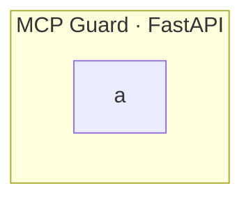
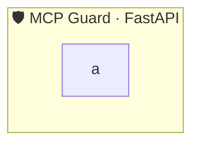
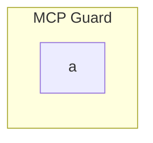
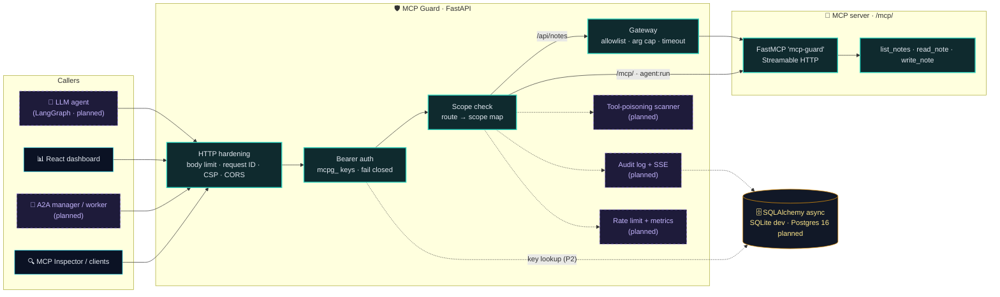

# mermaid test 6

### a GUARD no emoji

```mermaid
flowchart LR
    subgraph GUARD["MCP Guard · FastAPI"]
        x1["a"]
    end
```

### b MG with emoji

```mermaid
flowchart LR
    subgraph MG["🛡️ MCP Guard · FastAPI"]
        x1["a"]
    end
```

### c GUARD plain

```mermaid
flowchart LR
    subgraph GUARD["MCP Guard"]
        x1["a"]
    end
```

### d CORE fastapi

```mermaid
flowchart LR
    subgraph CORE["MCP Guard · FastAPI"]
        x1["a"]
    end
```

### e full arch renamed

```mermaid
flowchart LR
    subgraph CALLERS["Callers"]
        direction TB
        AG["🤖 LLM agent<br/>(LangGraph · planned)"]
        UI["📊 React dashboard"]
        A2A["🤝 A2A manager / worker<br/>(planned)"]
        INS["🔍 MCP Inspector / clients"]
    end

    subgraph CORE["🛡️ MCP Guard · FastAPI"]
        direction TB
        MW["HTTP hardening<br/>body limit · request ID · CSP · CORS"]
        AUTH["Bearer auth<br/>mcpg_ keys · fail closed"]
        SC["Scope check<br/>route → scope map"]
        GW["Gateway<br/>allowlist · arg cap · timeout"]
        SCAN["Tool-poisoning scanner<br/>(planned)"]
        AUD["Audit log + SSE<br/>(planned)"]
        RL["Rate limit + metrics<br/>(planned)"]
    end

    subgraph TOOLS["🔧 MCP server · /mcp/"]
        direction TB
        MCP["FastMCP 'mcp-guard'<br/>Streamable HTTP"]
        T1["list_notes · read_note · write_note"]
    end

    DB[("🗄️ SQLAlchemy async<br/>SQLite dev · Postgres 16 planned")]

    AG --> MW
    UI --> MW
    A2A --> MW
    INS --> MW
    MW --> AUTH --> SC
    SC -->|"/api/notes"| GW --> MCP
    SC -->|"/mcp/ · agent:run"| MCP
    MCP --> T1
    SC -.-> SCAN
    SC -.-> AUD
    SC -.-> RL
    AUTH -.->|"key lookup (P2)"| DB
    AUD -.-> DB

    classDef built fill:#0f2a2e,stroke:#2dd4bf,color:#e2e8f0,stroke-width:2px
    classDef planned fill:#1e1b3a,stroke:#a78bfa,color:#c4b5fd,stroke-dasharray:5 5
    classDef caller fill:#0b1224,stroke:#22d3ee,color:#e2e8f0
    classDef store fill:#111827,stroke:#f59e0b,color:#fde68a
    class MW,AUTH,SC,GW,MCP,T1 built
    class SCAN,AUD,RL,AG,A2A planned
    class UI,INS caller
    class DB store
```

### f full arch CORE no emoji

```mermaid
flowchart LR
    subgraph CALLERS["Callers"]
        direction TB
        AG["🤖 LLM agent<br/>(LangGraph · planned)"]
        UI["📊 React dashboard"]
        A2A["🤝 A2A manager / worker<br/>(planned)"]
        INS["🔍 MCP Inspector / clients"]
    end

    subgraph CORE["MCP Guard · FastAPI"]
        direction TB
        MW["HTTP hardening<br/>body limit · request ID · CSP · CORS"]
        AUTH["Bearer auth<br/>mcpg_ keys · fail closed"]
        SC["Scope check<br/>route → scope map"]
        GW["Gateway<br/>allowlist · arg cap · timeout"]
        SCAN["Tool-poisoning scanner<br/>(planned)"]
        AUD["Audit log + SSE<br/>(planned)"]
        RL["Rate limit + metrics<br/>(planned)"]
    end

    subgraph TOOLS["🔧 MCP server · /mcp/"]
        direction TB
        MCP["FastMCP 'mcp-guard'<br/>Streamable HTTP"]
        T1["list_notes · read_note · write_note"]
    end

    DB[("🗄️ SQLAlchemy async<br/>SQLite dev · Postgres 16 planned")]

    AG --> MW
    UI --> MW
    A2A --> MW
    INS --> MW
    MW --> AUTH --> SC
    SC -->|"/api/notes"| GW --> MCP
    SC -->|"/mcp/ · agent:run"| MCP
    MCP --> T1
    SC -.-> SCAN
    SC -.-> AUD
    SC -.-> RL
    AUTH -.->|"key lookup (P2)"| DB
    AUD -.-> DB

    classDef built fill:#0f2a2e,stroke:#2dd4bf,color:#e2e8f0,stroke-width:2px
    classDef planned fill:#1e1b3a,stroke:#a78bfa,color:#c4b5fd,stroke-dasharray:5 5
    classDef caller fill:#0b1224,stroke:#22d3ee,color:#e2e8f0
    classDef store fill:#111827,stroke:#f59e0b,color:#fde68a
    class MW,AUTH,SC,GW,MCP,T1 built
    class SCAN,AUD,RL,AG,A2A planned
    class UI,INS caller
    class DB store
```
