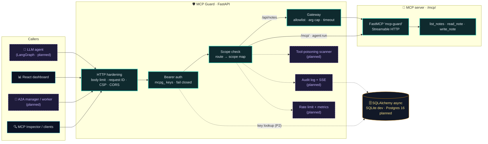
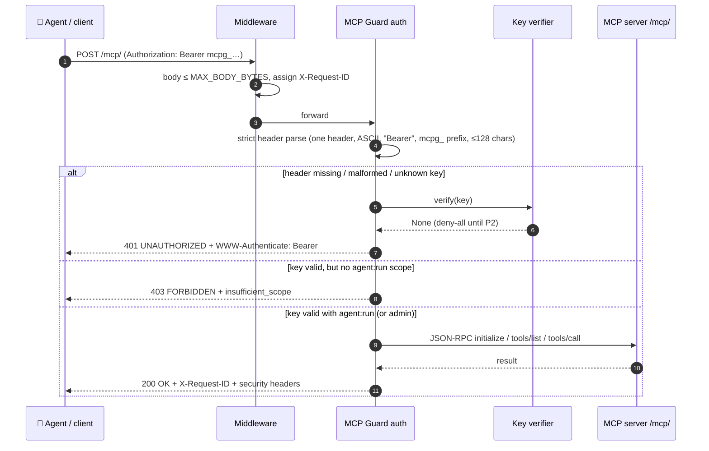
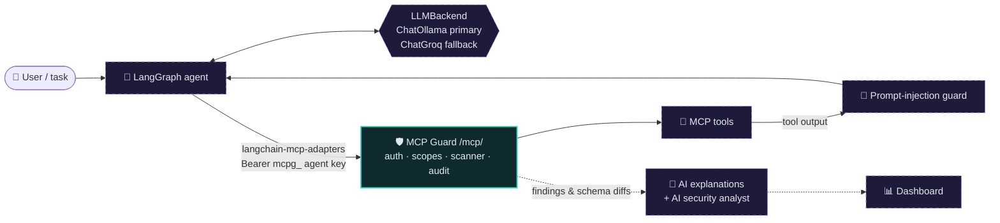

<div align="center">


<a href="#-why-mcp-guard">
  
</a>

<br><br>


<br>


<br>

<a href="LICENSE"></a>

<br><br>

<a href="#-why-mcp-guard"><b>Why</b></a> &nbsp;•&nbsp;
<a href="#-the-pipeline"><b>Pipeline</b></a> &nbsp;•&nbsp;
<a href="#%EF%B8%8F-architecture"><b>Architecture</b></a> &nbsp;•&nbsp;
<a href="#-features"><b>Features</b></a> &nbsp;•&nbsp;
<a href="#-genai-agents-that-cant-bypass-the-guard"><b>GenAI</b></a> &nbsp;•&nbsp;
<a href="#-security-model"><b>Security</b></a> &nbsp;•&nbsp;
<a href="#-run-it-locally"><b>Quickstart</b></a> &nbsp;•&nbsp;
<a href="#%EF%B8%8F-roadmap"><b>Roadmap</b></a> &nbsp;•&nbsp;
<a href="#-team"><b>Team</b></a>

</div>

<br>

**MCP Guard** sits between AI agents and the [Model Context Protocol](https://modelcontextprotocol.io) tools they call. Every request has to show a Bearer API key, pass a scope check, and go through one central gateway before a tool runs. If a check can't be made, the request is refused.

> [!IMPORTANT]
> **Honest status, October 2026.** This README keeps three labels apart: **✅ Built** (merged to `main` and checked against the code), **🚧 In progress** (open PR), and **🗺️ Planned** (on the roadmap, not written yet). One thing to know before you try it: `main` still ships the **deny-all key verifier**. Until the HMAC API-key work ([#84](https://github.com/aneek22112007-tech/mcp-a2a-secure/pull/84)) merges, every protected route and `/mcp/` answers `401`. That's the fail-closed default doing its job.

---

## 🤔 Why MCP Guard?

MCP makes it easy for an agent to reach tools. On its own it says nothing about **who** is calling, **what** they're allowed to do, or **whether the tool can be trusted**.

<table>
<tr>
<th width="50%">😱 The problem</th>
<th width="50%">🛡️ The MCP Guard fix</th>
</tr>
<tr>
<td><b>No auth on tool calls.</b> Many MCP servers accept any caller that can reach the port.</td>
<td>✅ Every <code>/mcp/</code> and protected REST call needs <code>Authorization: Bearer mcpg_…</code>. Unknown keys are refused.</td>
</tr>
<tr>
<td><b>All-or-nothing access.</b> A client that can list notes can usually overwrite them too.</td>
<td>✅ Least-privilege scopes (<code>notes:read</code>, <code>notes:write</code>, <code>agent:run</code>, …) are checked per route, and unmapped routes fail closed.</td>
</tr>
<tr>
<td><b>Tool poisoning.</b> Hidden instructions inside tool descriptions steer the model.</td>
<td>🗺️ A rule-based scanner, plus an AI second opinion, flags poisoned descriptions before a tool is exposed.</td>
</tr>
<tr>
<td><b>Schema rug-pulls.</b> A trusted tool quietly changes its definition later.</td>
<td>🗺️ Tool fingerprinting and pinning. A changed schema is held until someone re-approves it, and the AI explains what changed.</td>
</tr>
<tr>
<td><b>Prompt injection in tool output.</b> Returned text tries to hijack the agent.</td>
<td>🗺️ A prompt-injection guard screens tool output before it reaches the LLM.</td>
</tr>
<tr>
<td><b>No evidence.</b> After an incident nobody can say who called what.</td>
<td>✅ Request-ID on every response and log line. 🗺️ A persistent audit log streamed live over SSE.</td>
</tr>
</table>

---

## 🎬 The pipeline

<p align="center">
  
</p>

<p align="center"><sub>Three scenarios loop: <b>200</b> with a scoped key, <b>401</b> with no key, and <b>403</b> with the wrong scope. Dashed stages are planned.</sub></p>

---

## 🏗️ Architecture


```mermaid
flowchart LR
    subgraph CALLERS["Callers"]
        direction TB
        AG["🤖 LLM agent<br/>(LangGraph · planned)"]
        UI["📊 React dashboard"]
        A2A["🤝 A2A manager / worker<br/>(planned)"]
        INS["🔍 MCP Inspector / clients"]
    end

    subgraph GUARD["🛡️ MCP Guard · FastAPI"]
        direction TB
        MW["HTTP hardening<br/>body limit · request ID · CSP · CORS"]
        AUTH["Bearer auth<br/>mcpg_ keys · fail closed"]
        SC["Scope check<br/>route → scope map"]
        GW["Gateway<br/>allowlist · arg cap · timeout"]
        SCAN["Tool-poisoning scanner<br/>(planned)"]
        AUD["Audit log + SSE<br/>(planned)"]
        RL["Rate limit + metrics<br/>(planned)"]
    end

    subgraph TOOLS["🔧 MCP server · /mcp/"]
        direction TB
        MCP["FastMCP 'mcp-guard'<br/>Streamable HTTP"]
        T1["list_notes · read_note · write_note"]
    end

    DB[("🗄️ SQLAlchemy async<br/>SQLite dev · Postgres 16 planned")]

    AG --> MW
    UI --> MW
    A2A --> MW
    INS --> MW
    MW --> AUTH --> SC
    SC -->|"/api/notes"| GW --> MCP
    SC -->|"/mcp/ · agent:run"| MCP
    MCP --> T1
    SC -.-> SCAN
    SC -.-> AUD
    SC -.-> RL
    AUTH -.->|"key lookup (P2)"| DB
    AUD -.-> DB

    classDef built fill:#0f2a2e,stroke:#2dd4bf,color:#e2e8f0,stroke-width:2px
    classDef planned fill:#1e1b3a,stroke:#a78bfa,color:#c4b5fd,stroke-dasharray:5 5
    classDef caller fill:#0b1224,stroke:#22d3ee,color:#e2e8f0
    classDef store fill:#111827,stroke:#f59e0b,color:#fde68a
    class MW,AUTH,SC,GW,MCP,T1 built
    class SCAN,AUD,RL,AG,A2A planned
    class UI,INS caller
    class DB store
```

<sub>Solid teal = built · dashed violet = planned · amber = data store</sub>

### 🔐 An authenticated tool call, step by step


```mermaid
sequenceDiagram
    autonumber
    participant A as 🤖 Agent / client
    participant M as Middleware
    participant G as MCP Guard auth
    participant V as Key verifier
    participant S as MCP server /mcp/

    A->>M: POST /mcp/ (Authorization: Bearer mcpg_…)
    M->>M: body ≤ MAX_BODY_BYTES, assign X-Request-ID
    M->>G: forward
    G->>G: strict header parse (one header, ASCII, "Bearer", mcpg_ prefix, ≤128 chars)
    alt header missing / malformed / unknown key
        G->>V: verify(key)
        V-->>G: None (deny-all until P2)
        G-->>A: 401 UNAUTHORIZED + WWW-Authenticate: Bearer
    else key valid, but no agent:run scope
        G-->>A: 403 FORBIDDEN + insufficient_scope
    else key valid with agent:run (or admin)
        G->>S: JSON-RPC initialize / tools/list / tools/call
        S-->>G: result
        G-->>A: 200 OK + X-Request-ID + security headers
    end
```

<sub>On the 401 path a malformed header is rejected before the verifier is called. Every failure returns the same body, so a caller can't tell a wrong key from a missing one.</sub>

---

## ✨ Features

<table>
<tr>
<td width="33%" valign="top">

### 🔑 Bearer-key auth
✅ **Built**<br>
`Authorization: Bearer mcpg_…` on every protected route and on `/mcp/`. A pluggable `ApiKeyVerifier` that defaults to **deny-all**.

</td>
<td width="33%" valign="top">

### 🎯 Scopes
✅ **Built**<br>
`notes:read` · `notes:write` · `audit:read` · `agent:run` · `admin`. The app **refuses to start** if a route has no entry in the scope map.

</td>
<td width="33%" valign="top">

### 🔌 MCP over HTTP
✅ **Built**<br>
The official MCP Python SDK (FastMCP), mounted at **`/mcp/`** over Streamable HTTP, with notes tools you can try in MCP Inspector.

</td>
</tr>
<tr>
<td valign="top">

### 🚦 Central gateway
✅ **Built**<br>
REST tool calls go through `gateway.call_tool()`: tool allowlist, 128 KiB argument cap, 5 s timeout, cleaned-up errors.

</td>
<td valign="top">

### 🧱 HTTP hardening
✅ **Built**<br>
Body-size limit, request-ID logging, strict CSP and security headers, CORS allowlist, one JSON error envelope, docs disabled outside dev.

</td>
<td valign="top">

### 🗄️ Async data layer
✅ **Built**<br>
SQLAlchemy 2 async, Alembic migrations, repositories, and tables for clients, API keys, audit events and sandbox runs. Runs on SQLite today.

</td>
</tr>
<tr>
<td valign="top">

### 📊 React dashboard
✅ **Built**<br>
React 19, Vite and Tailwind. A live **Server Status** view (`/dashboard-v2`) reads `/api/status`. The other panels are UI prototypes on mock data.

</td>
<td valign="top">

### 🔐 HMAC API keys
🚧 **In progress** · [#84](https://github.com/aneek22112007-tech/mcp-a2a-secure/pull/84)<br>
Peppered HMAC key hashes with constant-time verification, admin `/api/keys` routes, and a bootstrap admin key script.

</td>
<td valign="top">

### 🧪 Tool-poisoning scanner
🗺️ **Planned**<br>
Rule-based detection, plus an AI reviewer that explains its findings. The rules decide; the AI only advises.

</td>
</tr>
<tr>
<td valign="top">

### 🧬 Fingerprint & pin
🗺️ **Planned**<br>
Canonical SHA-256 tool-schema fingerprints. A rug-pull is blocked until re-approved, with an AI explanation of what changed.

</td>
<td valign="top">

### 📜 Audit + live SSE
🗺️ **Planned**<br>
Every allow and deny written to `audit_events` and streamed to the dashboard. Rate limits, metrics and retention come next.

</td>
<td valign="top">

### 🤖 GenAI agents
🗺️ **Planned**<br>
LangChain and LangGraph agents, plus an A2A manager and worker, that reach tools **only** through MCP Guard, each with its own key.

</td>
</tr>
</table>

---

## 📌 Status at a glance

| | What | Where in the code |
|:-:|---|---|
| ✅ | FastAPI gateway app with middleware stack and routers | `api/app/main.py` |
| ✅ | MCP server mounted at `/mcp/` (Streamable HTTP, FastMCP `mcp-guard`) | `api/app/mcp_server.py`, `main.py` |
| ✅ | Notes tools `list_notes` / `read_note` / `write_note` with a path-traversal guard | `api/app/mcp_server.py` |
| ✅ | Notes REST API routed through the central gateway | `api/app/routes/notes.py`, `api/app/gateway.py` |
| ✅ | Bearer API-key auth and scopes on REST and `/mcp/` | `api/app/auth/` |
| ✅ | Fail-closed `DenyAllVerifier` as the default key verifier | `api/app/auth/verifier.py` |
| ✅ | Same 401/403 JSON envelope plus `WWW-Authenticate` everywhere | `api/app/errors.py`, `auth/mcp_asgi.py` |
| ✅ | Request-ID logging, body-size limit, security headers / CSP, CORS | `api/app/middleware.py`, `main.py` |
| ✅ | Live MCP handshake status endpoint | `api/app/routes/status.py` |
| ✅ | SQLAlchemy async + Alembic, SQLite in dev | `api/app/database.py`, `api/alembic/` |
| ✅ | React 19 dashboard with a live server-status view | `frontend/` |
| 🚧 | HMAC-hashed API keys, admin key routes, bootstrap admin key | PR [#84](https://github.com/aneek22112007-tech/mcp-a2a-secure/pull/84) |
| 🗺️ | Audit log + SSE · rate limit + metrics + retention · sandbox runner | roadmap |
| 🗺️ | Tool fingerprinting / pinning · rule-based + AI poisoning scanner | roadmap |
| 🗺️ | LangChain/LangGraph agent · A2A agents · Docker Compose + Postgres 16 | roadmap |

---

## 🧠 GenAI: agents that can't bypass the guard

> 🗺️ **Everything in this section is planned.** None of it is on `main` yet.

The GenAI track adds LLM agents, but they get **no back door**. An agent is just another MCP client with its own scoped key, and it reaches tools only through MCP Guard's `/mcp/` endpoint.


```mermaid
flowchart LR
    U(["👤 User / task"]) --> AG["🧠 LangGraph agent"]
    AG <--> LLM{{"LLMBackend<br/>ChatOllama primary<br/>ChatGroq fallback"}}
    AG -->|"langchain-mcp-adapters<br/>Bearer mcpg_ agent key"| MG["🛡️ MCP Guard /mcp/<br/>auth · scopes · scanner · audit"]
    MG --> T["🔧 MCP tools"]
    T -->|"tool output"| PI["🧹 Prompt-injection guard"]
    PI --> AG
    MG -.->|"findings & schema diffs"| EX["💬 AI explanations<br/>+ AI security analyst"]
    EX -.-> D["📊 Dashboard"]

    classDef planned fill:#1e1b3a,stroke:#a78bfa,color:#e2e8f0,stroke-dasharray:5 5
    classDef guard fill:#0f2a2e,stroke:#2dd4bf,color:#e2e8f0,stroke-width:2px
    class AG,LLM,PI,EX,D,T planned
    class MG guard
```

| Piece | Plan |
|---|---|
| 🧠 **Agent** | LangChain + LangGraph, with the model behind an `LLMBackend` interface: **ChatOllama** (local) as primary, **ChatGroq** as fallback |
| 🔌 **Tools** | Loaded with `langchain-mcp-adapters`, **always** through MCP Guard `/mcp/`, using the agent's own API key and scopes |
| 🧹 **Prompt-injection guard** | Tool output is screened before it goes back into the model's context |
| 💬 **AI explanations** | Plain-language explanations of schema tampering and scanner findings |
| 🕵️ **AI security analyst** | A dashboard assistant that helps triage audit events and findings |
| 🤝 **A2A** | LangGraph manager and worker agents. Each one is a separate MCP Guard client with its own key |

> [!NOTE]
> 🧷 **The guarantee: the LLM is never the final security authority.** Auth, scopes, fingerprint matches and scanner rules are deterministic code. A model can **explain, summarise and flag**. It can't grant a scope, approve a changed schema, unblock a tool or turn a check off. If the LLM is down, the guard still enforces everything.

---

## 🔒 Security model

<table>
<tr>
<td width="50%" valign="top">

#### 🚪 Fail closed, everywhere
- Default verifier is `DenyAllVerifier`. With no real verifier wired in, **nothing gets in**
- A route missing from `ROUTE_SCOPES` makes the app **refuse to start**. At request time an unmapped route returns `403`
- A verifier crash on `/mcp/` returns a generic `500` and never falls through to the tool
- `admin` is the only scope that satisfies every check

</td>
<td width="50%" valign="top">

#### 🕶️ No key enumeration
- Missing, malformed and unknown keys all get the **same** `401 Authentication required.`
- `WWW-Authenticate: Bearer` on 401, `error="insufficient_scope"` on 403
- One error envelope: `{"error": {code, message, details, request_id}}`
- Generic `500`s, with no stack traces, paths or SQL in responses

</td>
</tr>
<tr>
<td valign="top">

#### 🤐 No secrets in logs
- Auth logs only a deny **reason** (`missing` / `malformed` / `rejected`) or the **key prefix**
- Raw keys and hashes are never logged. Only key hashes are stored (`api_keys.key_hash`)
- `MCP_SELF_API_KEY` is held as a `SecretStr`
- Every log line carries `rid=<request-id>` for tracing

</td>
<td valign="top">

#### 🧾 Strict header parsing
- Exactly **one** `Authorization` header. Duplicates are rejected
- ASCII only, the form `Bearer <token>`, no extra spaces
- Token must start with `mcpg_` and be ≤ 128 chars
- `X-Request-ID` is accepted only if it matches `[A-Za-z0-9._:-]` and is ≤ 64 chars. Otherwise a UUID4 replaces it

</td>
</tr>
</table>

Also built: a `Content-Length` sanity check and streaming body cap (`413`), CSP `default-src 'none'; frame-ancestors 'none'`, `X-Frame-Options: DENY`, `nosniff`, `Referrer-Policy: no-referrer`, a CORS allowlist with no wildcard, and a note-name regex plus resolved-path check against traversal. Full STRIDE analysis: [`docs/THREAT_MODEL.md`](docs/THREAT_MODEL.md).

---

## 🚀 Run it locally

<details>
<summary><b>⚡ Quickstart</b> (backend + dashboard)</summary>

<br>

**Prerequisites:** Python 3.11+, [uv](https://docs.astral.sh/uv/), Node 20+.

```bash
git clone https://github.com/aneek22112007-tech/mcp-a2a-secure.git
cd mcp-a2a-secure/api

cp .env.example .env              # settings are read from api/.env
uv sync                           # install deps from uv.lock
uv run alembic upgrade head       # create the SQLite schema in api/data/
uv run python scripts/seed_dev.py # optional: dev clients (creates no keys)

uv run uvicorn app.main:app --reload --host 127.0.0.1 --port 8000 --log-config log_config.json
```

- API: <http://127.0.0.1:8000> · health: `/health` · Swagger: `/docs` (only when `ENVIRONMENT` is dev/development/local)
- MCP endpoint: `http://127.0.0.1:8000/mcp/`

**Dashboard** (in a second terminal):

```bash
cd frontend
npm install
npm run dev                       # http://localhost:5173  (live status at /dashboard-v2)
```

**MCP Inspector** over stdio (no auth on the stdio transport):

```bash
cd api
npx @modelcontextprotocol/inspector uv run python -m app.mcp_server
```

> On `main`, protected routes and `/mcp/` return `401` until the HMAC verifier from [#84](https://github.com/aneek22112007-tech/mcp-a2a-secure/pull/84) lands. `/health`, `/api/status` and `/api/mcp/info` are public.

</details>

<details>
<summary><b>🧭 API reference</b> (real routes, required scopes)</summary>

<br>

| Method | Path | Scope | What it does |
|:-:|---|:-:|---|
| `GET` | `/health` | 🌐 public | Liveness: `{"status":"ok","app":"MCP Guard"}` |
| `GET` | `/api/status` | 🌐 public | Real MCP handshake against `MCP_SELF_URL`: online/offline, latency, protocol version, tools. Reports `online` only when `MCP_SELF_API_KEY` holds a key with `agent:run` |
| `GET` | `/api/mcp/info` | 🌐 public | Server name, transport (`streamable-http`), endpoint (`/mcp/`), tool names |
| `GET` | `/api/notes` | `notes:read` | List note names (via gateway → `list_notes`) |
| `GET` | `/api/notes/{name}` | `notes:read` | Read a note (via gateway → `read_note`) |
| `PUT` | `/api/notes/{name}` | `notes:write` | Create or overwrite. Body `{"content": "..."}`, ≤ 100 KiB |
| `POST` `GET` `DELETE` | `/mcp/` | `agent:run` | MCP Streamable HTTP: `initialize`, `tools/list`, `tools/call` |
| `GET` | `/docs` · `/redoc` · `/openapi.json` | 🌐 dev only | Turned off when `ENVIRONMENT` isn't dev/development/local |

🚧 Coming with [#84](https://github.com/aneek22112007-tech/mcp-a2a-secure/pull/84): `POST` / `GET` / `DELETE` `/api/keys` (`admin`).

Note names must match `[A-Za-z0-9_-]{1,64}`. Gateway errors map to `400` (invalid args), `404` (unknown tool / note), `413` (too large), `504` (tool timeout).

</details>

<details>
<summary><b>🎯 Scopes</b></summary>

<br>

| Scope | Grants | Used by |
|---|---|---|
| `notes:read` | List and read notes | `GET /api/notes`, `GET /api/notes/{name}` |
| `notes:write` | Create and overwrite notes | `PUT /api/notes/{name}` |
| `agent:run` | Open an MCP session and call tools | everything under `/mcp/` |
| `audit:read` | Read the audit trail | reserved for the planned audit API |
| `admin` | Satisfies **every** scope check | operators; key management (#84) |

The mapping lives in [`api/app/auth/scopes.py`](api/app/auth/scopes.py) (`ROUTE_SCOPES`). Add a route without an entry and the app won't start.

</details>

<details>
<summary><b>⚙️ Configuration</b> (<code>api/.env</code>)</summary>

<br>

| Variable | Default | Purpose |
|---|---|---|
| `APP_NAME` | `MCP Guard` | Display name |
| `ENVIRONMENT` (alias `APP_ENV`) | `dev` | Anything other than `dev` / `development` / `local` turns off `/docs`, `/redoc`, `/openapi.json` |
| `CORS_ORIGINS` | `["http://localhost:5173"]` | JSON list of allowed origins (no wildcard) |
| `MCP_SELF_URL` | `http://127.0.0.1:8000/mcp/` | URL that `/api/status` probes |
| `MCP_SELF_API_KEY` | *(unset)* | `mcpg_` key with `agent:run`, used only by the status self-probe |
| `DATABASE_URL` | `sqlite+aiosqlite:///<api>/data/mcp_guard.db` | Async SQLAlchemy URL |
| `NOTES_DIR` | `api/data/notes` | Where notes are stored as `.md` files |
| `MAX_BODY_BYTES` | `1048576` | Request body cap (1 MiB) |
| `TOOL_TIMEOUT_S` | `5` | Gateway tool timeout in seconds |

Frontend: `VITE_MCP_GUARD_API_URL` (default `http://localhost:8000`).

> 🔐 Never commit `.env` files or real keys. `.env` is git-ignored, and `api/.env.example` contains no secrets.

</details>

<details>
<summary><b>🧪 Try it with curl</b> (401 · 403 · 200 · MCP initialize)</summary>

<br>

**401: no key** (this is what `main` returns today):

```bash
curl -i http://127.0.0.1:8000/api/notes
```
```http
HTTP/1.1 401 Unauthorized
www-authenticate: Bearer
x-request-id: 7479a8cd-…
content-security-policy: default-src 'none'; frame-ancestors 'none'

{"error":{"code":"UNAUTHORIZED","message":"Authentication required.","details":null,"request_id":"7479a8cd-…"}}
```

The responses below need a real key, which arrives with the P2 verifier ([#84](https://github.com/aneek22112007-tech/mcp-a2a-secure/pull/84)). `$READ_KEY` holds only `notes:read`, and `$AGENT_KEY` holds `agent:run`.

**403: right key, wrong scope:**

```bash
curl -i -X PUT http://127.0.0.1:8000/api/notes/hello \
  -H "Authorization: Bearer $READ_KEY" -H "Content-Type: application/json" \
  -d '{"content":"hi"}'
```
```http
HTTP/1.1 403 Forbidden
www-authenticate: Bearer error="insufficient_scope", scope="notes:write"

{"error":{"code":"FORBIDDEN","message":"Missing required scope: notes:write.","details":null,"request_id":"…"}}
```

**200: scoped read:**

```bash
curl -s http://127.0.0.1:8000/api/notes -H "Authorization: Bearer $READ_KEY"
# ["hello", ...]
```

**MCP `initialize` with a Bearer key:**

```bash
curl -i -X POST http://127.0.0.1:8000/mcp/ \
  -H "Authorization: Bearer $AGENT_KEY" \
  -H "Content-Type: application/json" \
  -H "Accept: application/json, text/event-stream" \
  -d '{"jsonrpc":"2.0","id":1,"method":"initialize","params":{"protocolVersion":"2025-06-18","capabilities":{},"clientInfo":{"name":"curl","version":"0"}}}'
```
```text
HTTP/1.1 200 OK
mcp-session-id: e246cc77…

event: message
data: {"jsonrpc":"2.0","id":1,"result":{"protocolVersion":"2025-06-18","capabilities":{…,"tools":{"listChanged":false}},"serverInfo":{"name":"mcp-guard",…}}}
```

Use `127.0.0.1` or `localhost`. The MCP SDK's DNS-rebinding protection rejects other `Host` headers with `421`.

</details>

<details>
<summary><b>🗂️ Project structure</b></summary>

<br>

```text
mcp-a2a-secure/
├── api/                        # MCP Guard backend (FastAPI + MCP)
│   ├── app/
│   │   ├── main.py             # app setup: middleware, routers, /mcp mount, scope-coverage check
│   │   ├── auth/               # bearer parsing, verifier, principal, scopes, MCP ASGI guard
│   │   ├── gateway.py          # single choke point for REST → tool calls
│   │   ├── mcp_server.py       # FastMCP "mcp-guard" + notes tools
│   │   ├── mcp_client.py       # Streamable HTTP client (status probe, demo)
│   │   ├── middleware.py       # body limit, request ID, security headers
│   │   ├── errors.py           # uniform JSON error envelope
│   │   ├── config.py           # pydantic-settings
│   │   ├── database.py         # async engine + sessions
│   │   ├── models/             # clients, api_keys, audit_events, sandbox_runs
│   │   ├── repos/              # repository layer
│   │   └── routes/             # notes.py, status.py
│   ├── alembic/                # migrations
│   ├── scripts/seed_dev.py     # dev clients (no credentials)
│   ├── tests/
│   ├── .env.example
│   ├── log_config.json
│   └── pyproject.toml
├── frontend/                   # React 19 + Vite + Tailwind (landing + dashboard)
├── backend/                    # separate Express auth proxy (Google sign-in for the web app)
├── docs/
│   ├── THREAT_MODEL.md
│   ├── MCP_IMPLEMENTATION.md
│   ├── DATA_MODEL.md
│   ├── ARCHITECTURE_NOTES.md
│   ├── RUNBOOK.md
│   └── assets/pipeline.svg
├── PERFORMANCE_BOTTLENECKS.md
└── LICENSE
```

</details>

📚 Deeper reading: [MCP implementation](docs/MCP_IMPLEMENTATION.md) · [Data model](docs/DATA_MODEL.md) · [Threat model](docs/THREAT_MODEL.md) · [Runbook](docs/RUNBOOK.md) · [Architecture notes](docs/ARCHITECTURE_NOTES.md)

---

## 🗺️ Roadmap

**October 2026 · 12 blocks · v1.0 target: 31 Oct 2026**  ✅ done · 🚧 in progress · ⏳ planned

- [x] ✅ **Block 1 · MCP server.** Notes MCP server on the official SDK with a path-traversal guard ([#74](https://github.com/aneek22112007-tech/mcp-a2a-secure/pull/74))
- [x] ✅ **Block 2 · MCP over HTTP.** `/mcp/` Streamable HTTP mount, MCP client and live status handshake ([#75](https://github.com/aneek22112007-tech/mcp-a2a-secure/pull/75), [#76](https://github.com/aneek22112007-tech/mcp-a2a-secure/pull/76))
- [x] ✅ **Block 3 · Gateway.** Central gateway, notes REST API, HTTP hardening ([#77](https://github.com/aneek22112007-tech/mcp-a2a-secure/pull/77), [#78](https://github.com/aneek22112007-tech/mcp-a2a-secure/pull/78))
- [x] ✅ **Block 4 · Data layer.** SQLAlchemy async models, Alembic migrations, repositories, integrity fixes ([#79](https://github.com/aneek22112007-tech/mcp-a2a-secure/pull/79), [#80](https://github.com/aneek22112007-tech/mcp-a2a-secure/pull/80), [#82](https://github.com/aneek22112007-tech/mcp-a2a-secure/pull/82))
- [x] ✅ **Block 5 · Errors & docs.** Error envelope, request-ID logging, threat model and runbook ([#81](https://github.com/aneek22112007-tech/mcp-a2a-secure/pull/81))
- [x] ✅ **Block 6 · Auth enforcement.** Bearer keys, scopes, fail-closed verifier, uniform 401/403 ([#83](https://github.com/aneek22112007-tech/mcp-a2a-secure/pull/83))
- [ ] 🚧 **Block 7 · API keys.** HMAC-hashed keys, admin key routes, bootstrap admin key ([#84](https://github.com/aneek22112007-tech/mcp-a2a-secure/pull/84))
- [ ] ⏳ **Block 8 · Audit.** Audit log on every allow/deny, plus SSE live events in the dashboard
- [ ] ⏳ **Block 9 · Operations.** Rate limiting, metrics and audit retention
- [ ] ⏳ **Block 10 · Tool integrity.** Sandbox runner, tool fingerprinting and pinning, rule-based + AI tool-poisoning scanner
- [ ] ⏳ **Block 11 · GenAI agent.** LangChain + LangGraph agent (`LLMBackend`: ChatOllama → ChatGroq), tools via `langchain-mcp-adapters` through `/mcp/`, prompt-injection guard, AI explanations, AI security analyst
- [ ] ⏳ **Block 12 · A2A & ship.** A2A manager/worker LangGraph agents, Docker Compose with Postgres 16, **v1.0**

---

## 👥 Team

<table align="center">
<tr>
<td align="center" width="220">
<a href="https://github.com/aneek22112007-tech">
<br>
<b>Aneek Das</b></a><br>
<sub>@aneek22112007-tech</sub>
</td>
<td align="center" width="220">
<a href="https://github.com/codeslayerpdx">
<br>
<b>Priyanshu Dwivedi</b></a><br>
<sub>@codeslayerpdx</sub>
</td>
</tr>
</table>

<p align="center">
  <a href="https://github.com/aneek22112007-tech/mcp-a2a-secure/graphs/contributors">
    
  </a>
</p>

<p align="center"><sub>Built as an OJT 2026 project on the Generative AI track.</sub></p>

---

## 📄 License

Released under the [MIT License](LICENSE).

<div align="center">

<sub>Deny by default · Scope everything · The LLM advises, the guard decides.</sub>


</div>
