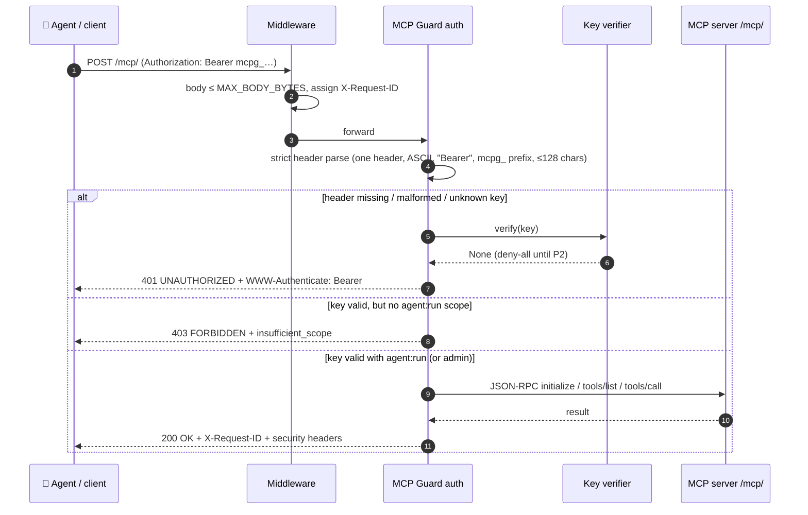
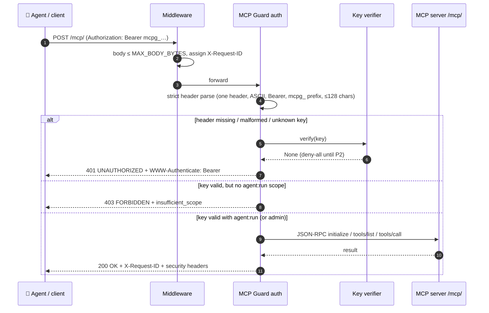
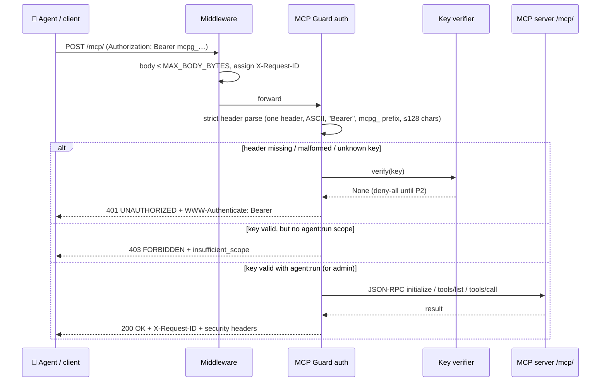
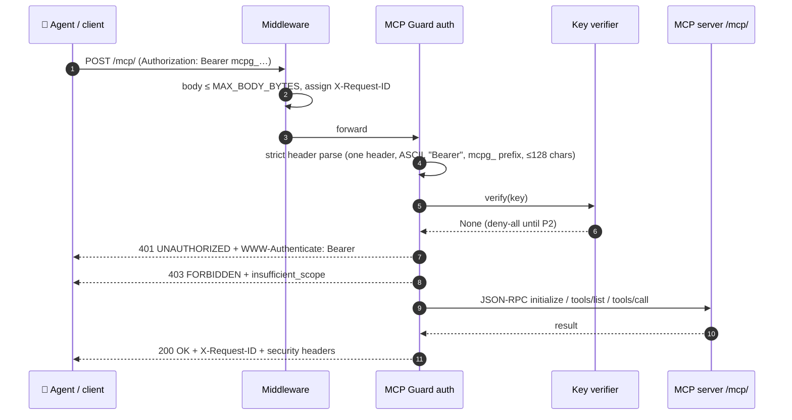
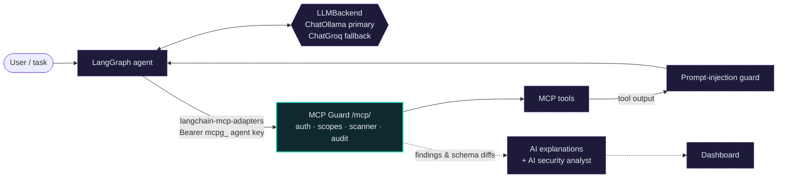
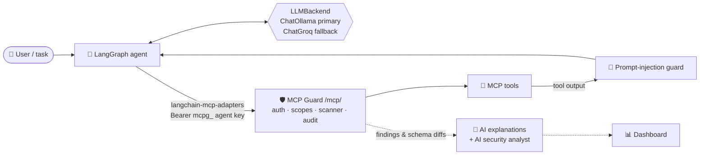

# mermaid test 2

## S1 seq real

```mermaid
sequenceDiagram
    autonumber
    participant A as 🤖 Agent / client
    participant M as Middleware
    participant G as MCP Guard auth
    participant V as Key verifier
    participant S as MCP server /mcp/

    A->>M: POST /mcp/ (Authorization: Bearer mcpg_…)
    M->>M: body ≤ MAX_BODY_BYTES, assign X-Request-ID
    M->>G: forward
    G->>G: strict header parse (one header, ASCII, "Bearer", mcpg_ prefix, ≤128 chars)
    alt header missing / malformed / unknown key
        G->>V: verify(key)
        V-->>G: None (deny-all until P2)
        G-->>A: 401 UNAUTHORIZED + WWW-Authenticate: Bearer
    else key valid, but no agent:run scope
        G-->>A: 403 FORBIDDEN + insufficient_scope
    else key valid with agent:run (or admin)
        G->>S: JSON-RPC initialize / tools/list / tools/call
        S-->>G: result
        G-->>A: 200 OK + X-Request-ID + security headers
    end
```

## S2 seq no dq

```mermaid
sequenceDiagram
    autonumber
    participant A as 🤖 Agent / client
    participant M as Middleware
    participant G as MCP Guard auth
    participant V as Key verifier
    participant S as MCP server /mcp/

    A->>M: POST /mcp/ (Authorization: Bearer mcpg_…)
    M->>M: body ≤ MAX_BODY_BYTES, assign X-Request-ID
    M->>G: forward
    G->>G: strict header parse (one header, ASCII, Bearer, mcpg_ prefix, ≤128 chars)
    alt header missing / malformed / unknown key
        G->>V: verify(key)
        V-->>G: None (deny-all until P2)
        G-->>A: 401 UNAUTHORIZED + WWW-Authenticate: Bearer
    else key valid, but no agent:run scope
        G-->>A: 403 FORBIDDEN + insufficient_scope
    else key valid with agent:run (or admin)
        G->>S: JSON-RPC initialize / tools/list / tools/call
        S-->>G: result
        G-->>A: 200 OK + X-Request-ID + security headers
    end
```

## S3 seq no emoji

```mermaid
sequenceDiagram
    autonumber
    participant A as Agent / client
    participant M as Middleware
    participant G as MCP Guard auth
    participant V as Key verifier
    participant S as MCP server /mcp/

    A->>M: POST /mcp/ (Authorization: Bearer mcpg_…)
    M->>M: body ≤ MAX_BODY_BYTES, assign X-Request-ID
    M->>G: forward
    G->>G: strict header parse (one header, ASCII, "Bearer", mcpg_ prefix, ≤128 chars)
    alt header missing / malformed / unknown key
        G->>V: verify(key)
        V-->>G: None (deny-all until P2)
        G-->>A: 401 UNAUTHORIZED + WWW-Authenticate: Bearer
    else key valid, but no agent:run scope
        G-->>A: 403 FORBIDDEN + insufficient_scope
    else key valid with agent:run (or admin)
        G->>S: JSON-RPC initialize / tools/list / tools/call
        S-->>G: result
        G-->>A: 200 OK + X-Request-ID + security headers
    end
```

## S4 seq no autonumber

```mermaid
sequenceDiagram
    participant A as 🤖 Agent / client
    participant M as Middleware
    participant G as MCP Guard auth
    participant V as Key verifier
    participant S as MCP server /mcp/

    A->>M: POST /mcp/ (Authorization: Bearer mcpg_…)
    M->>M: body ≤ MAX_BODY_BYTES, assign X-Request-ID
    M->>G: forward
    G->>G: strict header parse (one header, ASCII, "Bearer", mcpg_ prefix, ≤128 chars)
    alt header missing / malformed / unknown key
        G->>V: verify(key)
        V-->>G: None (deny-all until P2)
        G-->>A: 401 UNAUTHORIZED + WWW-Authenticate: Bearer
    else key valid, but no agent:run scope
        G-->>A: 403 FORBIDDEN + insufficient_scope
    else key valid with agent:run (or admin)
        G->>S: JSON-RPC initialize / tools/list / tools/call
        S-->>G: result
        G-->>A: 200 OK + X-Request-ID + security headers
    end
```

## S5 seq no alt

```mermaid
sequenceDiagram
    autonumber
    participant A as 🤖 Agent / client
    participant M as Middleware
    participant G as MCP Guard auth
    participant V as Key verifier
    participant S as MCP server /mcp/

    A->>M: POST /mcp/ (Authorization: Bearer mcpg_…)
    M->>M: body ≤ MAX_BODY_BYTES, assign X-Request-ID
    M->>G: forward
    G->>G: strict header parse (one header, ASCII, "Bearer", mcpg_ prefix, ≤128 chars)
        G->>V: verify(key)
        V-->>G: None (deny-all until P2)
        G-->>A: 401 UNAUTHORIZED + WWW-Authenticate: Bearer
        G-->>A: 403 FORBIDDEN + insufficient_scope
        G->>S: JSON-RPC initialize / tools/list / tools/call
        S-->>G: result
        G-->>A: 200 OK + X-Request-ID + security headers
```

## G1 gen real

```mermaid
flowchart LR
    U(["👤 User / task"]) --> AG["🧠 LangGraph agent"]
    AG <--> LLM{{"LLMBackend<br/>ChatOllama primary<br/>ChatGroq fallback"}}
    AG -->|"langchain-mcp-adapters<br/>Bearer mcpg_ agent key"| MG["🛡️ MCP Guard /mcp/<br/>auth · scopes · scanner · audit"]
    MG --> T["🔧 MCP tools"]
    T -->|"tool output"| PI["🧹 Prompt-injection guard"]
    PI --> AG
    MG -.->|"findings & schema diffs"| EX["💬 AI explanations<br/>+ AI security analyst"]
    EX -.-> D["📊 Dashboard"]

    classDef planned fill:#1e1b3a,stroke:#a78bfa,color:#e2e8f0,stroke-dasharray:5 5
    classDef guard fill:#0f2a2e,stroke:#2dd4bf,color:#e2e8f0,stroke-width:2px
    class AG,LLM,PI,EX,D,T planned
    class MG guard
```

## G2 gen no emoji

```mermaid
flowchart LR
    U(["User / task"]) --> AG["LangGraph agent"]
    AG <--> LLM{{"LLMBackend<br/>ChatOllama primary<br/>ChatGroq fallback"}}
    AG -->|"langchain-mcp-adapters<br/>Bearer mcpg_ agent key"| MG["MCP Guard /mcp/<br/>auth · scopes · scanner · audit"]
    MG --> T["MCP tools"]
    T -->|"tool output"| PI["Prompt-injection guard"]
    PI --> AG
    MG -.->|"findings & schema diffs"| EX["AI explanations<br/>+ AI security analyst"]
    EX -.-> D["Dashboard"]

    classDef planned fill:#1e1b3a,stroke:#a78bfa,color:#e2e8f0,stroke-dasharray:5 5
    classDef guard fill:#0f2a2e,stroke:#2dd4bf,color:#e2e8f0,stroke-width:2px
    class AG,LLM,PI,EX,D,T planned
    class MG guard
```

## G3 gen no classdef

```mermaid
flowchart LR
    U(["👤 User / task"]) --> AG["🧠 LangGraph agent"]
    AG <--> LLM{{"LLMBackend<br/>ChatOllama primary<br/>ChatGroq fallback"}}
    AG -->|"langchain-mcp-adapters<br/>Bearer mcpg_ agent key"| MG["🛡️ MCP Guard /mcp/<br/>auth · scopes · scanner · audit"]
    MG --> T["🔧 MCP tools"]
    T -->|"tool output"| PI["🧹 Prompt-injection guard"]
    PI --> AG
    MG -.->|"findings & schema diffs"| EX["💬 AI explanations<br/>+ AI security analyst"]
    EX -.-> D["📊 Dashboard"]


```

## G4 gen no bidir

```mermaid
flowchart LR
    U(["👤 User / task"]) --> AG["🧠 LangGraph agent"]
    AG --> LLM{{"LLMBackend<br/>ChatOllama primary<br/>ChatGroq fallback"}}
    AG -->|"langchain-mcp-adapters<br/>Bearer mcpg_ agent key"| MG["🛡️ MCP Guard /mcp/<br/>auth · scopes · scanner · audit"]
    MG --> T["🔧 MCP tools"]
    T -->|"tool output"| PI["🧹 Prompt-injection guard"]
    PI --> AG
    MG -.->|"findings & schema diffs"| EX["💬 AI explanations<br/>+ AI security analyst"]
    EX -.-> D["📊 Dashboard"]

    classDef planned fill:#1e1b3a,stroke:#a78bfa,color:#e2e8f0,stroke-dasharray:5 5
    classDef guard fill:#0f2a2e,stroke:#2dd4bf,color:#e2e8f0,stroke-width:2px
    class AG,LLM,PI,EX,D,T planned
    class MG guard
```

## A1 arch no emoji

```mermaid
flowchart LR
    subgraph CALLERS["Callers"]
        direction TB
        AG["LLM agent<br/>(LangGraph · planned)"]
        UI["React dashboard"]
        A2A["A2A manager / worker<br/>(planned)"]
        INS["MCP Inspector / clients"]
    end

    subgraph GUARD["MCP Guard · FastAPI"]
        direction TB
        MW["HTTP hardening<br/>body limit · request ID · CSP · CORS"]
        AUTH["Bearer auth<br/>mcpg_ keys · fail closed"]
        SC["Scope check<br/>route → scope map"]
        GW["Gateway<br/>allowlist · arg cap · timeout"]
        SCAN["Tool-poisoning scanner<br/>(planned)"]
        AUD["Audit log + SSE<br/>(planned)"]
        RL["Rate limit + metrics<br/>(planned)"]
    end

    subgraph TOOLS["MCP server · /mcp/"]
        direction TB
        MCP["FastMCP 'mcp-guard'<br/>Streamable HTTP"]
        T1["list_notes · read_note · write_note"]
    end

    DB[("SQLAlchemy async<br/>SQLite dev · Postgres 16 planned")]

    AG --> MW
    UI --> MW
    A2A --> MW
    INS --> MW
    MW --> AUTH --> SC
    SC -->|"/api/notes"| GW --> MCP
    SC -->|"/mcp/ · agent:run"| MCP
    MCP --> T1
    SC -.-> SCAN
    SC -.-> AUD
    SC -.-> RL
    AUTH -.->|"key lookup (P2)"| DB
    AUD -.-> DB

    classDef built fill:#0f2a2e,stroke:#2dd4bf,color:#e2e8f0,stroke-width:2px
    classDef planned fill:#1e1b3a,stroke:#a78bfa,color:#c4b5fd,stroke-dasharray:5 5
    classDef caller fill:#0b1224,stroke:#22d3ee,color:#e2e8f0
    classDef store fill:#111827,stroke:#f59e0b,color:#fde68a
    class MW,AUTH,SC,GW,MCP,T1 built
    class SCAN,AUD,RL,AG,A2A planned
    class UI,INS caller
    class DB store
```
