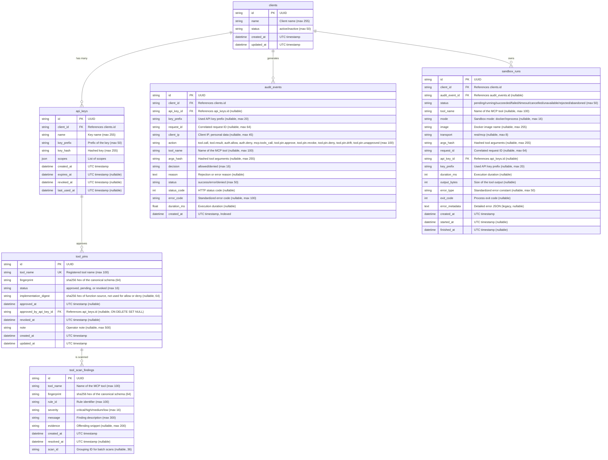

# MCP Guard Data Model

This document outlines the core data model for MCP Guard, which includes clients, API keys, audit events, sandbox execution runs, and tool pins.

## Entity Relationship Diagram

## Schema Details

- **clients**: Represents an integrated system or human actor.
- **api_keys**: Hashed access credentials tied to a client. Uses a prefix for identification and a JSON list for `scopes`.
- **audit_events**: Immutable ledger of access decisions and tool executions. Contains performance metrics (`duration_ms`) and failure insights. The table is append-only. Mutating tools write `tool.call` (status `forwarded`) and then `tool.result`. `client_ip` is personal data and is kept for the same retention period as the rest of the row. On Postgres, the trigger rejects UPDATE, DELETE and TRUNCATE on `audit_events`. The exceptions are the retention delete (`repos.audit.delete_events_before` sets `SET LOCAL mcp_guard.audit_retention = 'on'`) and the `api_key_id` ON DELETE SET NULL update. SQLite relies on the ORM guard. A database owner can disable triggers, so production should use a non-owner role. The only sanctioned delete path is `app.repos.audit.delete_events_before`, used for retention.
- **sandbox_runs**: Tracks the execution lifecycle of sandboxed processes initiated by a client. Statuses include `pending`, `running`, `succeeded`, `failed`, `timeout`, `cancelled`, `unavailable`, `rejected`, and `abandoned`. The `error_type` column stores standardized error constants. A `stale_run` error type indicates a run was stuck in `running` or `pending` status after a crash and was marked failed by the startup sweep or retention task. It links to `audit_events` via `audit_event_id`.
- **tool_pins**: One row per tool name. `fingerprint` is the sha256 of the canonical name, description, input schema, and output schema when the tool has one. `status` is `approved`, `pending`, or `revoked`. `implementation_digest` records the registered function source when it can be read. Allow and deny decisions do not read that column. `approved_by_api_key_id` points at the admin key that last approved the row and becomes null if that key row is deleted. Sync inserts a pending row when the live fingerprint is not already stored. Approve replaces the fingerprint with the live one. Revoke keeps the row and sets `revoked_at`.
- **tool_scan_findings**: Stores risk findings generated by the rule-based scanner. Contains `rule_id`, `severity`, and `evidence`. Tools with open findings of a severity in `SCANNER_BLOCK_SEVERITIES` are denied execution when `TOOL_PINNING_MODE` is `enforce`.

All `datetime` columns are stored as naive UTC in SQLite and read back as timezone-aware UTC objects via the `UTCDateTime` custom type.
Foreign keys are strictly enforced on SQLite connections.
