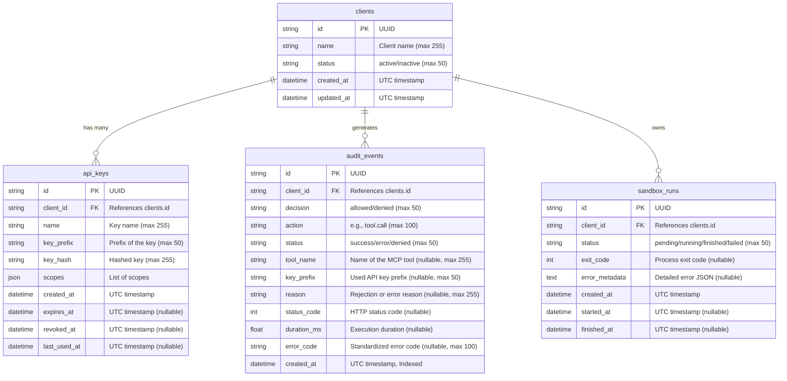

# MCP-A2A-Secure Data Model

This document outlines the core data model for MCP-A2A-Secure (Polaris), which includes clients, API keys, audit events, and sandbox execution runs.

## Entity Relationship Diagram

## Schema Details

- **clients**: Represents an integrated system or human actor.
- **api_keys**: Hashed access credentials tied to a client. Uses a prefix for identification and a JSON list for `scopes`.
- **audit_events**: Immutable ledger of access decisions and tool executions. Contains performance metrics (`duration_ms`) and failure insights.
- **sandbox_runs**: Tracks the execution lifecycle of sandboxed processes initiated by a client.

All `datetime` columns are stored as naive UTC in SQLite and read back as timezone-aware UTC objects via the `UTCDateTime` custom type.
Foreign keys are strictly enforced on SQLite connections.
